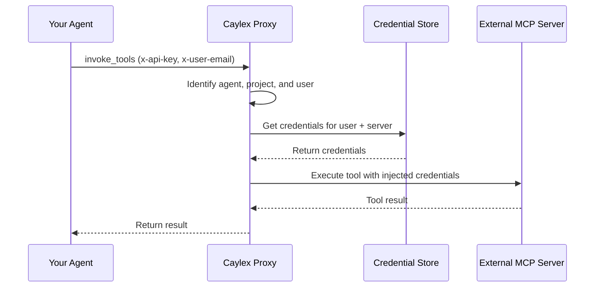

Caylex has two layers of authentication: **platform authentication** (how developers access the Caylex dashboard) and **server authentication** (how end users authenticate with external MCP servers).

## Platform authentication

Caylex uses SSO for platform access. When you sign up or log in to the Caylex dashboard, you authenticate through the platform's identity provider. This gives you access to manage your organization's projects, servers, agents, and analytics.

Platform authentication is separate from server authentication — logging into Caylex does not automatically grant access to external MCP servers.

## Server authentication

Server authentication determines how your **end users** (the people interacting with your AI agents) authenticate with external MCP servers like GitHub, Slack, or Linear. This is the more important concept to understand, as it directly affects how your agents access external data.

### Two levels of server auth

Caylex supports two levels of authentication for each server:

<Tabs>
  <Tab title="User-level auth">
    Each end user provides **their own credentials** for the server. When the agent executes a tool on behalf of a user, the proxy uses that user's personal credentials.

    **How it works:**
    - Each user authenticates individually via an [Auth Link](/auth/auth-links)
    - The proxy stores each user's credentials separately
    - Tool calls use the credentials of the specific user identified by `x-user-email`

    **Best for:**
    - Personal data services (email, calendar, personal notes)
    - Services where each user has their own account (GitHub, Slack)
    - Scenarios requiring per-user data isolation and audit trails

    **Example:** Your agent accesses a user's Gmail inbox. Each user authenticates with their own Google account, and the agent only sees that user's emails.
  </Tab>
  <Tab title="Project-level auth">
    A single set of **shared credentials** is used for the entire project. All users in the project share the same access level through a service account or shared API key.

    **How it works:**
    - An admin provides credentials once via a project-level [Auth Link](/auth/auth-links)
    - All users in the project share these credentials
    - Tool calls use the shared credentials regardless of which user triggered them

    **Best for:**
    - Shared resources (company CRM, shared databases, internal APIs)
    - Service accounts with broad read access
    - Scenarios where individual user accounts are not applicable

    **Example:** Your agent accesses a company CRM. A single API key provides read access to all customer records, shared across all users in the project.
  </Tab>
</Tabs>

<Tip>
You can mix auth levels within a project. For example, use user-level auth for Gmail (personal emails) and project-level auth for your company CRM (shared data) — all in the same project.
</Tip>

### Supported auth methods

Caylex supports the following authentication methods for connecting to external MCP servers:

| Method | Description | Credential storage |
| --- | --- | --- |
| **OAuth** | Standard OAuth 2.0 flow with PKCE support | Tokens managed by identity provider |
| **Header** | API keys or Bearer tokens sent as HTTP headers | Encrypted in AWS Parameter Store |
| **Path** | Credentials embedded in the URL path | Encrypted in AWS Parameter Store |
| **Query** | Credentials passed as URL query parameters | Encrypted in AWS Parameter Store |
| **No Auth** | No authentication required | N/A |

<Note>
Caylex never stores raw secrets in its database. OAuth tokens are managed by the identity provider, and all other credentials are stored in AWS Parameter Store. The database only stores references (paths) to the encrypted values.
</Note>

## How auth flows at runtime

When your agent invokes a tool through the Caylex Proxy, the authentication flow happens automatically:

1. Your agent sends a tool invocation to the proxy with the `x-api-key` and `x-user-email` headers
2. The proxy identifies the agent instance, project, and user
3. The proxy retrieves the user's credentials for the target server
4. Credentials are injected into the request (as headers, path parameters, query parameters, or OAuth tokens)
5. The tool is executed on the external server and the result is returned to your agent

Your agent never sees or handles credentials directly.

## Next steps

<CardGroup cols={2}>
  <Card title="Auth Links" icon="link" href="/auth/auth-links">
    Create shareable links to authenticate users with your servers.
  </Card>
  <Card title="Managing Users" icon="users" href="/auth/managing-users">
    View user auth status and manage access.
  </Card>
</CardGroup>
