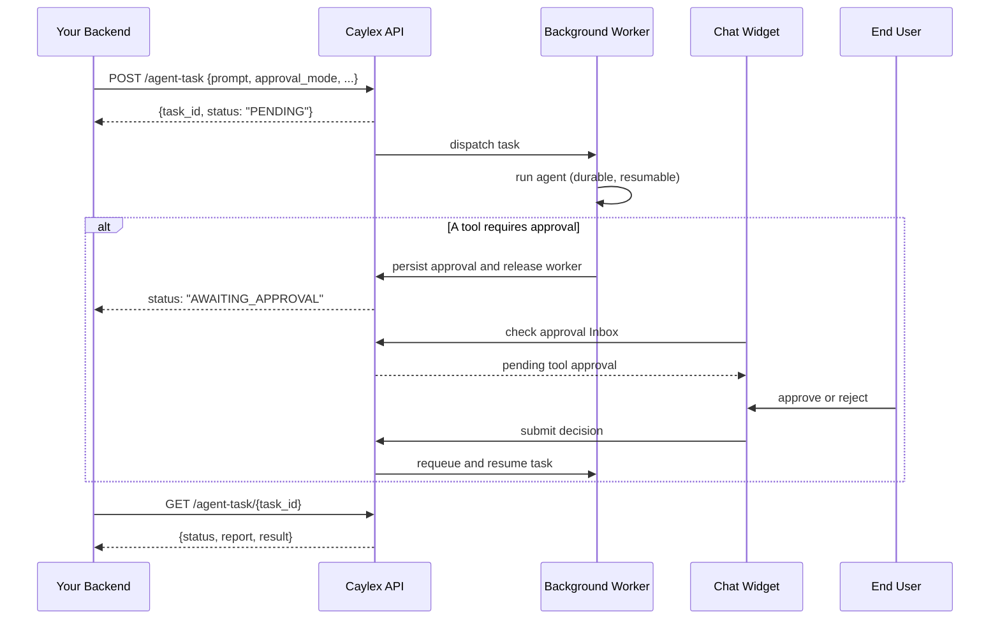

The chat widget runs the Caylex agent interactively. **Background agent tasks** let your backend hand the same agent a long-running job to complete on its own, without keeping an HTTP connection open. You submit a prompt, get a `task_id` back immediately, and poll for the result when it's done.

This is ideal for work that takes longer than a request cycle: multi-step research, batch updates across connected tools, scheduled summaries, and similar autonomous jobs.

Background tasks can also pause for human approval before running sensitive tools. When that mode is enabled, the Caylex chat widget surfaces the pending action in its **Inbox**, then the worker resumes after the user approves or rejects it.

## Overview

A background task is launched server-to-server, authenticated exactly like [agent session init](/widget/model-selection) (a platform access token). Caylex records the task, runs it on a dedicated background worker, and persists progress as it goes so the run is durable: if a worker is interrupted, the task resumes from the last completed step rather than starting over.

<Note>
Background tasks do not ask conversational follow-up questions. Human-in-the-loop mode is limited to deterministic approval cards for tools configured to require approval.
</Note>

## How It Works



The run executes against the same project, tools, and per-user authentication as an interactive session for that `user_email`, so the agent can use every integration the user is connected to.

## Submit a Task

```
POST https://api.caylex.ai/api/v1/agent-task
Authorization: Bearer <platform_access_token>
```

```json
{
  "caylex_api_key": "ck_your_navigator_api_key",
  "user_email": "jane@example.com",
  "prompt": "Review last week's support tickets and draft a summary of recurring issues.",
  "skill_ref": "weekly-report",
  "model": "anthropic/claude-opus-4.8",
  "approval_mode": "human"
}
```

| Field | Required | Description |
| --- | --- | --- |
| `caylex_api_key` | Yes | Production navigator API key (`ck_…`). |
| `user_email` | Yes | End-user the task runs as; determines per-user tool authentication. |
| `prompt` | Yes | The task instructions for the agent. |
| `skill_ref` | No | Name or slug of an existing [project skill](/platform/projects). Validated against the project at submit time (404 if not found); the agent is required to load it before starting the task. |
| `model` | No | OpenRouter model id from the [allowed list](/widget/model-selection#allowed-models). Unsupported values are ignored (the agent's configured model is used) and return a `model_warning`. |
| `approval_mode` | No | How tools configured to require approval are handled: `exclude` (default), `human`, or `auto_approve`. See [Tool Approval](#tool-approval). |
| `background_agent_auto_approve_tools` | No | Deprecated compatibility alias. `true` maps to `approval_mode: "auto_approve"` and `false` maps to `"exclude"`. Do not send both fields with conflicting values. |

### Response

```json
{
  "task_id": "f55a0be6-dd20-4f37-96c8-b7b8119797ba",
  "status": "PENDING",
  "model": "anthropic/claude-opus-4.8",
  "model_warning": null
}
```

## Poll for Status

```
GET https://api.caylex.ai/api/v1/agent-task/{task_id}
Authorization: Bearer <platform_access_token>
```

```json
{
  "task_id": "f55a0be6-dd20-4f37-96c8-b7b8119797ba",
  "status": "COMPLETED",
  "report": "Reviewed 142 tickets. Drafted a summary covering the 3 most common issues...",
  "result": { "text": "...", "tool_calls_made": 18, "hit_iteration_limit": false },
  "error": null,
  "created_at": "2026-06-18T15:00:00+00:00",
  "started_at": "2026-06-18T15:00:03+00:00",
  "completed_at": "2026-06-18T15:04:21+00:00"
}
```

| Status | Meaning |
| --- | --- |
| `PENDING` | Queued, not yet picked up. |
| `RUNNING` | A worker is actively running (or resuming) the task. |
| `AWAITING_APPROVAL` | The task released its worker and is waiting for a user to approve or reject a tool call. |
| `COMPLETED` | The agent finished. `report` holds its final summary. |
| `INCOMPLETE` | The agent stopped having done partial work; see `report`. |
| `FAILED` | The task errored after exhausting its retries; see `error`. |

Poll on an interval that suits your task length (for example, every few seconds). The `report` field contains the agent's own summary of what it completed versus what it could not.

## Tool Approval

Some tools require explicit user approval before they run—for example, tools that send a message, write data, or otherwise change external state. Set `approval_mode` according to the task's trust model:

- **`exclude` (default)** — approval-gated tools are excluded from the run. The agent completes what it can with the remaining tools and explains any limitation in its report.
- **`human`** — approval-gated tools remain available, but the task pauses before execution. The matching end user can approve or reject the action from the chat widget Inbox.
- **`auto_approve`** — approval-gated tools execute without a user decision. Use this only when the task is explicitly authorized to perform those actions autonomously.

<Warning>
`approval_mode: "auto_approve"` lets the background agent execute state-changing tools—including sending, writing, and deleting—with no human in the loop.
</Warning>

### Human approvals in the chat widget

Human approval mode uses the `user_email` and navigator associated with the task to route approvals:

1. The worker reaches a tool configured as **User Approval**, persists the pending action, changes the task to `AWAITING_APPROVAL`, and releases its worker lease.
2. A chat widget initialized for the same navigator and `user_email` shows a notification on the session menu and an item in the **Inbox** tab.
3. Opening the item shows the background task transcript and approval card. The message composer is disabled because this remains a background task, not an interactive conversation.
4. After the user submits decisions, Caylex requeues the task, executes only approved actions, records rejected actions as tool results, and continues the workflow.
5. If another approval is needed while the transcript is open, the next approval card appears inline. The user does not need to return to the Inbox.

The task does not hold a worker or browser connection while it waits. An unanswered approval expires after seven days, is treated as rejected, and the task resumes so it can finish with an accurate report.

<Note>
The Inbox is an interruption surface, not a background-task history browser. Pending items disappear after a decision. If the user keeps the transcript open, it continues updating until the task finishes.
</Note>

## Skills

To point the agent at a specific [skill](/platform/projects), pass its name or slug as `skill_ref`. The reference is validated against the project when you submit the task (you get a `404` if it doesn't exist), and the agent is given a mandatory instruction to load that skill (by its resolved id) and follow it before doing any work. Omit `skill_ref` to let the agent discover and use skills on its own.

## Example

<Tabs>
  <Tab title="Python">
    ```python agent_task.py
    import asyncio
    import httpx

    CAYLEX_API_URL = "https://api.caylex.ai/api/v1/"
    PLATFORM_TOKEN = "your_platform_access_token"
    CAYLEX_API_KEY = "ck_your_navigator_api_key"


    async def run_background_task(user_email: str, prompt: str) -> dict:
        async with httpx.AsyncClient() as client:
            # 1. Submit the task.
            submit = await client.post(
                f"{CAYLEX_API_URL}agent-task",
                headers={"Authorization": f"Bearer {PLATFORM_TOKEN}"},
                json={
                    "caylex_api_key": CAYLEX_API_KEY,
                    "user_email": user_email,
                    "prompt": prompt,
                    "approval_mode": "human",
                },
            )
            submit.raise_for_status()
            task_id = submit.json()["task_id"]

            # 2. Poll until it finishes.
            while True:
                await asyncio.sleep(5)
                status = await client.get(
                    f"{CAYLEX_API_URL}agent-task/{task_id}",
                    headers={"Authorization": f"Bearer {PLATFORM_TOKEN}"},
                )
                status.raise_for_status()
                data = status.json()
                if data["status"] in ("COMPLETED", "INCOMPLETE", "FAILED"):
                    return data
    ```
  </Tab>

  <Tab title="TypeScript">
    ```typescript agentTask.ts
    const CAYLEX_API_URL = "https://api.caylex.ai/api/v1/";
    const PLATFORM_TOKEN = process.env.CAYLEX_PLATFORM_TOKEN!;
    const CAYLEX_API_KEY = process.env.CAYLEX_NAVIGATOR_API_KEY!;

    const sleep = (ms: number) => new Promise((r) => setTimeout(r, ms));

    export async function runBackgroundTask(userEmail: string, prompt: string) {
      // 1. Submit the task.
      const submit = await fetch(`${CAYLEX_API_URL}agent-task`, {
        method: "POST",
        headers: {
          Authorization: `Bearer ${PLATFORM_TOKEN}`,
          "Content-Type": "application/json",
        },
        body: JSON.stringify({
          caylex_api_key: CAYLEX_API_KEY,
          user_email: userEmail,
          prompt,
          approval_mode: "human",
        }),
      });
      if (!submit.ok) throw new Error("Failed to submit agent task");
      const { task_id } = await submit.json();

      // 2. Poll until it finishes.
      while (true) {
        await sleep(5000);
        const res = await fetch(`${CAYLEX_API_URL}agent-task/${task_id}`, {
          headers: { Authorization: `Bearer ${PLATFORM_TOKEN}` },
        });
        if (!res.ok) throw new Error("Failed to fetch agent task status");
        const data = await res.json();
        if (["COMPLETED", "INCOMPLETE", "FAILED"].includes(data.status)) {
          return data;
        }
      }
    }
    ```
  </Tab>
</Tabs>
