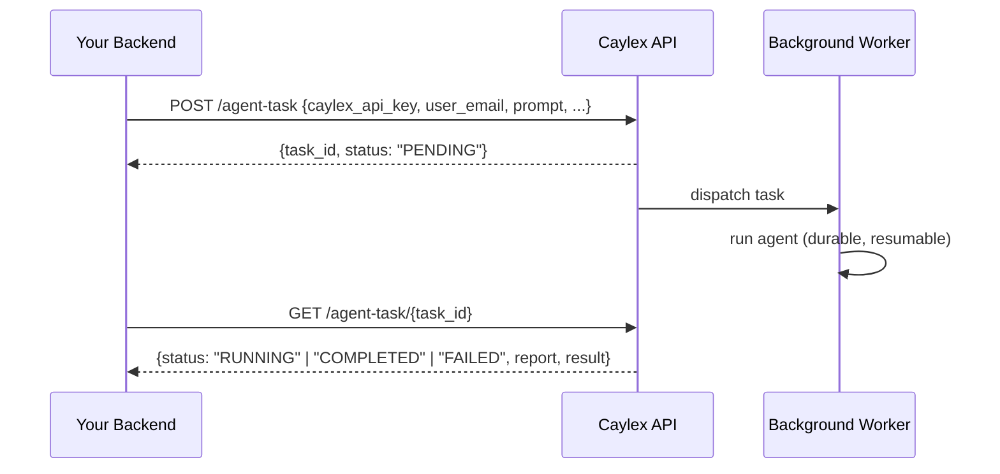

The chat widget runs the Caylex agent interactively. **Background agent tasks** let your backend hand the same agent a long-running job to complete on its own — no widget, no open connection. You submit a prompt, get a `task_id` back immediately, and poll for the result when it's done.

This is ideal for work that takes longer than a request cycle: multi-step research, batch updates across connected tools, scheduled summaries, and similar autonomous jobs.

## Overview

A background task is launched server-to-server, authenticated exactly like [agent session init](/widget/model-selection) (a platform access token). Caylex records the task, runs it on a dedicated background worker, and persists progress as it goes so the run is durable: if a worker is interrupted, the task resumes from the last completed step rather than starting over.

<Note>
Background tasks run autonomously. The agent is instructed that there is no user to answer follow-up questions; it completes as much as it safely can and ends with a report of what it finished and what it could not.
</Note>

## How It Works



The run executes against the same project, tools, and per-user authentication as an interactive session for that `user_email`, so the agent can use every integration the user is connected to.

## Submit a Task

```
POST https://api.caylex.ai/api/v1/agent-task
Authorization: Bearer <platform_access_token>
```

```json
{
  "caylex_api_key": "ck_your_navigator_api_key",
  "user_email": "jane@example.com",
  "prompt": "Review last week's support tickets and draft a summary of recurring issues.",
  "skill_ref": "weekly-report",
  "model": "anthropic/claude-opus-4.8",
  "background_agent_auto_approve_tools": false
}
```

| Field | Required | Description |
| --- | --- | --- |
| `caylex_api_key` | Yes | Production navigator API key (`ck_…`). |
| `user_email` | Yes | End-user the task runs as; determines per-user tool authentication. |
| `prompt` | Yes | The task instructions for the agent. |
| `skill_ref` | No | Name or slug of a skill available to the selected navigator: either a [project skill](/platform/projects) or one of that navigator's global skills. Validated at submit time (404 if unavailable); the agent is required to load it before starting the task. |
| `model` | No | OpenRouter model id from the [allowed list](/widget/model-selection#allowed-models). Unsupported values are ignored (the agent's configured model is used) and return a `model_warning`. |
| `background_agent_auto_approve_tools` | No | Defaults to `false`. Controls whether the agent may run tools that require user approval — see [Tool Approval](#tool-approval) below. |

### Response

```json
{
  "task_id": "f55a0be6-dd20-4f37-96c8-b7b8119797ba",
  "status": "PENDING",
  "model": "anthropic/claude-opus-4.8",
  "model_warning": null,
  "resolved_skill": {
    "id": "7783f27a-a6f9-45c7-a801-f1a0ee61091a",
    "name": "Weekly Report",
    "slug": "weekly-report",
    "source": "project"
  },
  "skill_warning": null
}
```

When `skill_ref` is provided, `resolved_skill` identifies the exact skill
selected for the task. If a project skill and one of the navigator's global
skills share the requested slug, the project skill takes precedence and
`skill_warning` explains that choice.

## Poll for Status

```
GET https://api.caylex.ai/api/v1/agent-task/{task_id}
Authorization: Bearer <platform_access_token>
```

```json
{
  "task_id": "f55a0be6-dd20-4f37-96c8-b7b8119797ba",
  "status": "COMPLETED",
  "report": "Reviewed 142 tickets. Drafted a summary covering the 3 most common issues...",
  "result": {
    "text": "...",
    "tool_calls_made": 18,
    "hit_iteration_limit": false,
    "final_report_produced": true
  },
  "error": null,
  "created_at": "2026-06-18T15:00:00+00:00",
  "started_at": "2026-06-18T15:00:03+00:00",
  "completed_at": "2026-06-18T15:04:21+00:00"
}
```

| Status | Meaning |
| --- | --- |
| `PENDING` | Queued, not yet picked up. |
| `RUNNING` | A worker is actively running (or resuming) the task. |
| `COMPLETED` | The agent finished. `report` holds its final summary. |
| `INCOMPLETE` | The agent stopped having done partial work; see `report`. |
| `FAILED` | The task errored after exhausting its retries; see `error`. |

Poll on an interval that suits your task length (for example, every few seconds). The `report` field contains the agent's own summary of what it completed versus what it could not.

The report is the agent's final, self-contained assistant message. Text emitted
alongside earlier tool calls is retained in the transcript but is not included
in `report`. If the agent stops before producing a final report, the task is
marked `INCOMPLETE` and `result.final_report_produced` is `false`.

## Fetch the Transcript

Use the paginated transcript endpoint when you need an audit trail or want to
inspect the agent's intermediate messages and tool activity:

```
GET https://api.caylex.ai/api/v1/agent-task/{task_id}/transcript?limit=50&cursor=120
Authorization: Bearer <platform_access_token>
```

Omit `cursor` for the first page. Pass the returned `next_cursor` on the next
request. You can fetch the transcript while the task is running; subsequent
messages have higher cursor values.

```json
{
  "task_id": "f55a0be6-dd20-4f37-96c8-b7b8119797ba",
  "status": "RUNNING",
  "messages": [
    {
      "id": "9a577550-2dfa-4d0c-9b22-224b63149315",
      "sequence_number": 121,
      "role": "assistant",
      "message_type": "assistant",
      "content": [
        { "type": "text", "text": "I found 142 tickets to review." }
      ],
      "created_at": "2026-06-18T15:01:12+00:00"
    }
  ],
  "next_cursor": 121,
  "has_more": false
}
```

The transcript includes task messages, assistant messages, tool calls, and tool
results. System prompts, compaction records, hidden internal messages, and
internal credential storage are not included. Transcript data may contain
information read from connected tools, so treat it as sensitive customer data.

## Tool Approval

Some tools require explicit user approval before they run (for example, anything that sends a message, writes data, or otherwise changes external state). A background task has **no interactive user to grant that approval**, so by default Caylex handles this safely:

- **`background_agent_auto_approve_tools: false` (default)** — approval-gated tools are **excluded** from the run entirely. The agent can't see or call them; it completes what it can with the remaining (read/no-approval) tools and notes in its report what it couldn't do. This prevents a background agent from taking a sensitive action no one approved.
- **`background_agent_auto_approve_tools: true`** — the agent **may run approval-gated tools without a user decision**. Set this only when you intend for the task to perform those actions autonomously (e.g. a scheduled job that sends an email or updates records).

<Warning>
Setting `background_agent_auto_approve_tools: true` lets the background agent execute state-changing tools (sending, writing, deleting) with no human in the loop. Use it only for tasks you explicitly want to act on their own.
</Warning>

For example, a "send me a morning briefing email" task needs `background_agent_auto_approve_tools: true` — with the default, the agent will compile the briefing but the email-send tool is unavailable, so it will report the briefing instead of sending it.

## Skills

To point the agent at a specific [skill](/platform/projects), pass its name or slug as `skill_ref`. This can be a project skill or a global skill attached to the navigator identified by `caylex_api_key`. The reference is validated when you submit the task (you get a `404` if it is not available to that navigator), and the agent is given a mandatory instruction to load that skill by its resolved id and follow it before doing any work.

Only one `skill_ref` can be attached to a task. Omit it to let the agent discover and use available skills on its own.

## Example

<Tabs>
  <Tab title="Python">
    ```python agent_task.py
    import asyncio
    import httpx

    CAYLEX_API_URL = "https://api.caylex.ai/api/v1/"
    PLATFORM_TOKEN = "your_platform_access_token"
    CAYLEX_API_KEY = "ck_your_navigator_api_key"


    async def run_background_task(user_email: str, prompt: str) -> dict:
        async with httpx.AsyncClient() as client:
            # 1. Submit the task.
            submit = await client.post(
                f"{CAYLEX_API_URL}agent-task",
                headers={"Authorization": f"Bearer {PLATFORM_TOKEN}"},
                json={
                    "caylex_api_key": CAYLEX_API_KEY,
                    "user_email": user_email,
                    "prompt": prompt,
                },
            )
            submit.raise_for_status()
            task_id = submit.json()["task_id"]

            # 2. Poll until it finishes.
            while True:
                await asyncio.sleep(5)
                status = await client.get(
                    f"{CAYLEX_API_URL}agent-task/{task_id}",
                    headers={"Authorization": f"Bearer {PLATFORM_TOKEN}"},
                )
                status.raise_for_status()
                data = status.json()
                if data["status"] in ("COMPLETED", "INCOMPLETE", "FAILED"):
                    return data
    ```
  </Tab>

  <Tab title="TypeScript">
    ```typescript agentTask.ts
    const CAYLEX_API_URL = "https://api.caylex.ai/api/v1/";
    const PLATFORM_TOKEN = process.env.CAYLEX_PLATFORM_TOKEN!;
    const CAYLEX_API_KEY = process.env.CAYLEX_NAVIGATOR_API_KEY!;

    const sleep = (ms: number) => new Promise((r) => setTimeout(r, ms));

    export async function runBackgroundTask(userEmail: string, prompt: string) {
      // 1. Submit the task.
      const submit = await fetch(`${CAYLEX_API_URL}agent-task`, {
        method: "POST",
        headers: {
          Authorization: `Bearer ${PLATFORM_TOKEN}`,
          "Content-Type": "application/json",
        },
        body: JSON.stringify({
          caylex_api_key: CAYLEX_API_KEY,
          user_email: userEmail,
          prompt,
        }),
      });
      if (!submit.ok) throw new Error("Failed to submit agent task");
      const { task_id } = await submit.json();

      // 2. Poll until it finishes.
      while (true) {
        await sleep(5000);
        const res = await fetch(`${CAYLEX_API_URL}agent-task/${task_id}`, {
          headers: { Authorization: `Bearer ${PLATFORM_TOKEN}` },
        });
        if (!res.ok) throw new Error("Failed to fetch agent task status");
        const data = await res.json();
        if (["COMPLETED", "INCOMPLETE", "FAILED"].includes(data.status)) {
          return data;
        }
      }
    }
    ```
  </Tab>
</Tabs>
