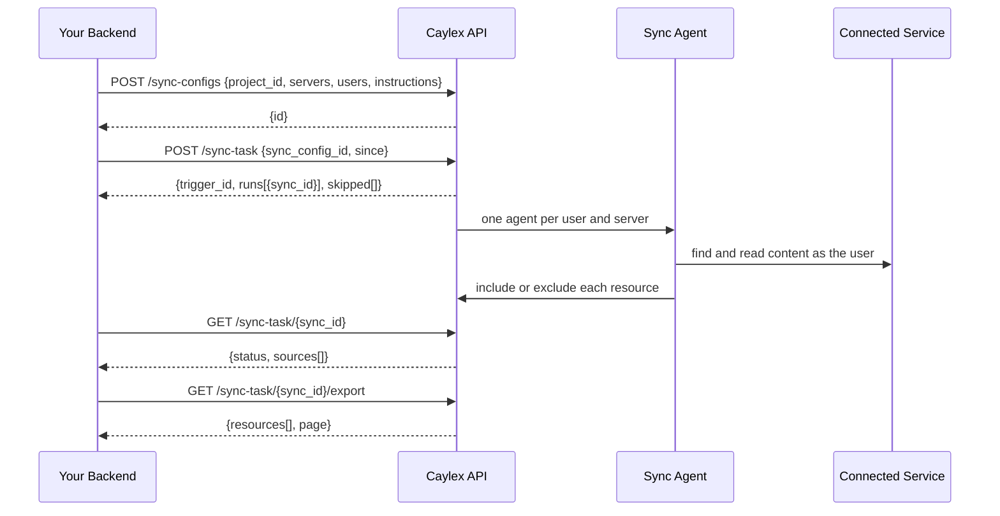

**Background sync** collects content from connected services, such as their Notion pages or Google Drive files, and returns it as one uniform JSON export. You save a **sync config** that names the servers, the users, and what to collect. Then you trigger it from your backend whenever you want fresh content for a search index, RAG pipeline, or knowledge base.

Each trigger starts one [background agent](/background-tasks/agent-tasks) per user and server. The agent finds and reads the content your instructions describe, as that user, and decides which resources belong in the export. The export contains the content exactly as the service returned it, not an agent's summary of it.

<Note>
Background sync is a premium feature. A tenant admin turns it on under **Administration > Premium Features**. Creating, editing, and triggering configs requires it. Reading configs, runs, transcripts, and exports, and deleting configs, keep working when it's off.
</Note>

## Concepts

| Term | What it is |
| --- | --- |
| **Sync config** | A saved sync in a project: its servers, its users (a list, or every project user), and the instructions the agent follows. |
| **Trigger** | One `POST /sync-task` call. It creates one sync run per user and returns a `trigger_id` that groups them. Use the `trigger_id` only to [list those runs](#track-the-runs-in-a-trigger); the status, export, transcript, and continue calls take a run's `sync_id`. |
| **Sync run** | One user's sync. Identified by `sync_id`, with one source per server that user can access. |
| **Source** | One server within a run, labelled by its type (for example `notion`). Each source has its own agent, status, and transcript. |
| **Export** | The uniform JSON for a run: every resource the agents included, in one format across services. |

## How It Works



You call every Background Sync endpoint with your platform access token; you don't need a navigator or a navigator API key. Sync agents are instructed to only read, and tools that require approval are never available to them.

### Supported servers

Background Sync works with selected servers from the Caylex catalog. These are supported today:

<div style={{ display: "flex", flexWrap: "wrap", alignItems: "center", gap: "2rem" }}>
  <span style={{ display: "inline-flex", alignItems: "center", gap: "0.5rem" }}><strong>Notion</strong></span>
  <span style={{ display: "inline-flex", alignItems: "center", gap: "0.5rem" }}><strong>Google Drive</strong></span>
  <span style={{ display: "inline-flex", alignItems: "center", gap: "0.5rem" }}><strong>Google Docs</strong></span>
  <span style={{ display: "inline-flex", alignItems: "center", gap: "0.5rem" }}><strong>GitHub</strong></span>
</div>

Call [`GET /sync-configs/sources`](#1-find-the-servers-you-can-sync) to see which servers in your project can be synced. Custom servers aren't supported.

### How the agent decides what to export

While it crawls, the agent records a decision for every resource it reads. You'll see these decisions in the run's [transcript](#read-a-transcript):

- **Include** a resource that matches your instructions. Including a container, such as a folder, parent page, or database, with its descendants covers everything under it that the run fetched.
- **Exclude** a resource that doesn't match, with a reason. Excluding a container also excludes what's only reachable through it.
- **Unresolved** marks a request it couldn't fulfil, for example because the service needs authentication.

Only included resources are exported. Anything the agent read but didn't decide on is listed in the export's `undecided` array instead.

## Before You Start

You need:

- the **Background Sync** toggle turned on under **Administration > Premium Features** in the Caylex Platform (only a tenant admin can change it);
- a server-side [platform access token](/auth/platform-authentication);
- a [project](/platform/projects) with at least one supported, unpaused server; and
- users of that project who have [authenticated](/auth/auth-links) with those servers. Project-level shared credentials also count.

All endpoints use the Platform API base URL and Bearer authentication:

```
Base URL:  https://api.caylex.ai/api/v1
Header:    Authorization: Bearer <platform_access_token>
```

<Warning>
Exports and transcripts contain complete customer documents, database rows, comments, and other sensitive content. Keep the platform token and everything you download server-side, apply your normal retention controls, and never commit exports to source control.
</Warning>

## 1. Find the Servers You Can Sync

```
GET https://api.caylex.ai/api/v1/sync-configs/sources?project_id={project_id}
```

This returns the project's unpaused servers that support Background Sync:

```json
{
  "sources": [
    {
      "server_instance_id": "5a8d1c3e-2b7f-4e90-a6c4-9d1e3f5b7a28",
      "server_name": "Notion",
      "display_name": "Team Notion",
      "source_type": "notion",
      "rules_version": 1
    },
    {
      "server_instance_id": "6b9e2d4f-3c80-4fa1-b7d5-0e2f4a6c8b39",
      "server_name": "Google Drive",
      "display_name": null,
      "source_type": "google_drive",
      "rules_version": 2
    }
  ]
}
```

## 2. Create a Sync Config

```
POST https://api.caylex.ai/api/v1/sync-configs
```

```json
{
  "project_id": "7e1f2a3b-4c5d-6e7f-8a9b-0c1d2e3f4a5b",
  "name": "Weekly Notion and Drive export",
  "instructions": "Collect the pages and documents in the Engineering wiki and the Engineering Drive folder, with their full content.",
  "server_instance_ids": [
    "5a8d1c3e-2b7f-4e90-a6c4-9d1e3f5b7a28",
    "6b9e2d4f-3c80-4fa1-b7d5-0e2f4a6c8b39"
  ],
  "all_users": false,
  "user_emails": ["alex@example.com", "sam@example.com"]
}
```

| Field | Required | Description |
| --- | --- | --- |
| `project_id` | Yes | The project whose servers and users the config uses. Set at creation and can't be changed. |
| `name` | Yes | Unique within the project, up to 255 characters. |
| `instructions` | Yes | What to collect, up to 50,000 characters. Every run's agent follows them. |
| `server_instance_ids` | Yes | One to ten server instances from `GET /sync-configs/sources`. |
| `all_users` | No | `true` syncs every user of the project, resolved each time you trigger. Defaults to `false`. Playground users are never included. |
| `user_emails` | When `all_users` is `false` | Users to sync. Each must already be a user of the project. Leave it empty when `all_users` is `true`. |

The response is the saved config, with each server's `source_type` and an `available` flag. `available` turns `false` if a server is later paused or stops supporting Background Sync, and triggers skip that server.

Creating a config returns `400` for an invalid server or user list, `404` when the project doesn't exist, and `409` when the project already has a config with that name.

### Writing good instructions

The agent searches and reads based on your instructions, so be as specific as you would with a colleague:

- **Name the scope**: the workspace, teamspace, folder, repository, or page tree to start from.
- **Say what counts**: document types, topics, owners, or labels that belong in the export.
- **Say what doesn't**: archived, draft, or personal content you want left out.

Use the trigger's `since` field for date ranges instead of writing them into the instructions, so the same config works for full and incremental syncs.

## 3. Check User Access

Before you trigger, you can see which users can reach which servers:

```
GET https://api.caylex.ai/api/v1/sync-configs/{sync_config_id}/access
```

```json
{
  "items": [
    {
      "user_email": "alex@example.com",
      "project_user": true,
      "servers": [
        { "server_instance_id": "5a8d1c3e-...", "auth_status": "authenticated", "accessible": true },
        { "server_instance_id": "6b9e2d4f-...", "auth_status": "authenticated", "accessible": true }
      ]
    },
    {
      "user_email": "sam@example.com",
      "project_user": true,
      "servers": [
        { "server_instance_id": "5a8d1c3e-...", "auth_status": "shared_auth", "accessible": true },
        { "server_instance_id": "6b9e2d4f-...", "auth_status": "not_authenticated", "accessible": false }
      ]
    }
  ],
  "meta": { "size": 20, "total": 2, "next_cursor": null, "has_next": false, "has_prev": false }
}
```

A trigger skips every user and server pair that isn't `accessible`:

| `auth_status` | Accessible | Meaning |
| --- | --- | --- |
| `no_auth_required` | Yes | The server needs no credentials. |
| `authenticated` | Yes | The user connected their own account. |
| `shared_auth` | Yes | Project or tenant credentials cover every user. |
| `not_authenticated` | No | The user needs to authenticate, for example through an [auth link](/auth/auth-links). |
| `needs_project_admin` | No | A project admin must provide shared credentials. |
| `needs_tenant_admin` | No | A tenant admin must provide credentials. |
| `not_syncable` | No | The server was paused or no longer supports Background Sync. |

`project_user: false` flags a listed user who has left the project.

<Note>
Google Drive and Google Docs sources can read only the files each user has selected to share with Caylex. Content outside that selection won't appear in their exports.
</Note>

## 4. Trigger a Sync

```
POST https://api.caylex.ai/api/v1/sync-task
```

```json
{
  "sync_config_id": "3f6c2a91-8d4e-4b7a-9c15-2e8f0d6b1a47",
  "since": "2026-09-21T00:00:00Z"
}
```

| Field | Required | Description |
| --- | --- | --- |
| `sync_config_id` | Yes | The config to run. |
| `since` | No | ISO 8601 timestamp. The agent looks only for content created or modified after it, and the export drops anything older. See [Incremental syncs](#incremental-syncs). |
| `skill_ref` | No | Name or slug of a [project skill](/platform/projects) the agent loads before it starts. Returns `404` if the skill doesn't exist. |

The request accepts only these fields. Every run uses the config's saved instructions.

The trigger starts every run, or none of them:

```json
{
  "trigger_id": "8c1f3e5a-7d92-4b06-8e4a-1f3b5d7c9e40",
  "sync_config_id": "3f6c2a91-8d4e-4b7a-9c15-2e8f0d6b1a47",
  "status": "pending",
  "since": "2026-09-21T00:00:00Z",
  "runs": [
    {
      "sync_id": "9d2a4f6b-8ea3-4c17-9f5b-2a4c6e8d0f51",
      "user_email": "alex@example.com",
      "sources": [
        { "source": "notion", "source_type": "notion", "server_name": "Notion", "server_instance_id": "5a8d1c3e-...", "resolved_by": "explicit", "config_warnings": [], "task_id": "be4c6b8d-..." },
        { "source": "google_drive", "source_type": "google_drive", "server_name": "Google Drive", "server_instance_id": "6b9e2d4f-...", "resolved_by": "explicit", "config_warnings": [], "task_id": "cf5d7c9e-..." }
      ]
    },
    {
      "sync_id": "ad3b5a7c-9fb4-4d28-a06c-3b5d7f9e1a62",
      "user_email": "sam@example.com",
      "sources": [
        { "source": "notion", "source_type": "notion", "server_name": "Notion", "server_instance_id": "5a8d1c3e-...", "resolved_by": "explicit", "config_warnings": [], "task_id": "e17f9eaf-..." }
      ]
    }
  ],
  "skipped": [
    {
      "user_email": "sam@example.com",
      "server_instance_id": "6b9e2d4f-...",
      "server_name": "Google Drive",
      "reason": "not_accessible",
      "auth_status": "not_authenticated"
    }
  ],
  "skipped_count": 1,
  "resolved_skill": null,
  "skill_warning": null
}
```

Each source's `source` label is unique within its run. It's the source type, qualified by the server name when a config includes two servers of the same type, for example `notion-team-wiki`. Use it to address one source in the status, export, transcript, and continue endpoints. `config_warnings` lists changes to the server's tools that may affect what the sync can collect; the source still runs.

`skipped` lists the first 100 user and server pairs that didn't run, and `skipped_count` has the total:

| `reason` | Meaning |
| --- | --- |
| `not_a_project_user` | A listed user is no longer a user of the project. |
| `not_syncable` | The server was paused or no longer supports Background Sync. |
| `not_accessible` | The user can't reach the server. `auth_status` says why. |

A trigger returns `400` when no user can access any of the config's servers, or when it would exceed the [limits](#limits). It returns `409` when Caylex can't start the sync; `detail` says why.

## 5. Poll for Status

```
GET https://api.caylex.ai/api/v1/sync-task/{sync_id}
```

```json
{
  "sync_id": "9d2a4f6b-8ea3-4c17-9f5b-2a4c6e8d0f51",
  "status": "incomplete",
  "sync_config_id": "3f6c2a91-8d4e-4b7a-9c15-2e8f0d6b1a47",
  "trigger_id": "8c1f3e5a-7d92-4b06-8e4a-1f3b5d7c9e40",
  "user_email": "alex@example.com",
  "instructions": "Collect the pages and documents in the Engineering wiki and the Engineering Drive folder, with their full content.",
  "since": "2026-09-21T00:00:00Z",
  "created_at": "2026-09-28T09:20:00+00:00",
  "sources": [
    {
      "source": "notion",
      "task_id": "be4c6b8d-a0c5-4e39-b17d-4c6e8a0f2b73",
      "session_id": "d06e8daf-c2e7-405b-939f-6e8a0c2b4d95",
      "status": "COMPLETED",
      "started_at": "2026-09-28T09:20:04+00:00",
      "completed_at": "2026-09-28T09:26:41+00:00",
      "error": null,
      "summary": {
        "status": "ok",
        "counts": { "resources_seen": 14, "included": 12, "exported": 12, "excluded": 2, "undecided": 0, "unresolved": 0 }
      }
    },
    {
      "source": "google_drive",
      "task_id": "cf5d7c9e-b1d6-4f4a-828e-5d7f9b1a3c84",
      "session_id": "f2809fb0-e4a9-4b7d-a5b1-8a0c2e4d6f17",
      "status": "INCOMPLETE",
      "started_at": "2026-09-28T09:20:05+00:00",
      "completed_at": "2026-09-28T09:31:12+00:00",
      "error": null,
      "summary": null
    }
  ]
}
```

The response above is trimmed. Each source also repeats its `source_type`, `server_name`, `server_instance_id`, `resolved_by`, and `config_warnings`, and `summary` carries the full `counts` and `diagnostics` described in [Export format](#export-format). `summary` is set once the source finishes.

A run's status summarizes its sources:

| Run `status` | Meaning |
| --- | --- |
| `pending` | No source has started yet. |
| `running` | At least one source is still running. |
| `completed` | Every source completed. |
| `incomplete` | Every source finished and at least one is `INCOMPLETE`. You can [continue](#continue-a-run) it. |
| `failed` | Every source finished, none is `INCOMPLETE`, and at least one `FAILED`. |

Each source's `status` is `PENDING`, `RUNNING`, `COMPLETED`, `INCOMPLETE`, or `FAILED`. A source is `INCOMPLETE` when the agent stopped before it finished, for example because it ran out of iterations, or when it read content but included none of it and left some undecided. A `FAILED` source hit an error; see `error`.

### Track the runs in a trigger

A trigger has no status of its own. Its `trigger_id` only groups the runs it created, one per user, and each run finishes independently. The `status` in the trigger response is always `pending` and isn't updated afterwards.

Use a run's `sync_id` to check or act on that user's sync. The status, export, transcript, and continue endpoints all take a `sync_id`. Passing a `trigger_id` to them returns `404`. Keep each `sync_id` from the trigger response's `runs`, along with its `user_email`.

To check every run in a trigger with one call, filter the run list by `trigger_id`:

```
GET https://api.caylex.ai/api/v1/sync-task?trigger_id={trigger_id}&size=100
```

```json
{
  "items": [
    {
      "sync_id": "ad3b5a7c-9fb4-4d28-a06c-3b5d7f9e1a62",
      "sync_config_id": "3f6c2a91-8d4e-4b7a-9c15-2e8f0d6b1a47",
      "trigger_id": "8c1f3e5a-7d92-4b06-8e4a-1f3b5d7c9e40",
      "user_email": "sam@example.com",
      "status": "running",
      "sources": [
        { "source": "notion", "source_type": "notion", "server_name": "Notion", "server_instance_id": "5a8d1c3e-...", "task_id": "e17f9eaf-...", "status": "RUNNING" }
      ]
    },
    {
      "sync_id": "9d2a4f6b-8ea3-4c17-9f5b-2a4c6e8d0f51",
      "sync_config_id": "3f6c2a91-8d4e-4b7a-9c15-2e8f0d6b1a47",
      "trigger_id": "8c1f3e5a-7d92-4b06-8e4a-1f3b5d7c9e40",
      "user_email": "alex@example.com",
      "status": "incomplete",
      "sources": [
        { "source": "notion", "source_type": "notion", "server_name": "Notion", "server_instance_id": "5a8d1c3e-...", "task_id": "be4c6b8d-...", "status": "COMPLETED" },
        { "source": "google_drive", "source_type": "google_drive", "server_name": "Google Drive", "server_instance_id": "6b9e2d4f-...", "task_id": "cf5d7c9e-...", "status": "INCOMPLETE" }
      ]
    }
  ],
  "meta": { "size": 100, "total": 2, "next_cursor": null, "has_next": false, "has_prev": false }
}
```

Each item is one run, with the run and source `status` values described above. The response is trimmed: each item also has the run's `instructions`, `since`, and `created_at`. The list doesn't include a source's `summary`, `error`, or timestamps; call `GET /sync-task/{sync_id}` for those. Runs are listed newest first. A trigger can create up to 500 runs and `size` is at most 100, so pass `meta.next_cursor` as `cursor` while `meta.has_next` is `true`. The list also gives you each run's `sync_id` again if you didn't keep the trigger response.

You don't need to wait for the whole trigger. As each run reaches `completed`, `incomplete`, or `failed`, use its `sync_id` to [fetch its export](#6-fetch-the-export), [continue](#continue-a-run) it if it's `incomplete`, or read its sources' `error` with `GET /sync-task/{sync_id}` if it `failed`. The trigger is done when every run has finished. This loop does that with the `client` from the [example](#example):

```python
FINISHED = {"completed", "incomplete", "failed"}


def trigger_runs(client: httpx.Client, trigger_id: str) -> list[dict]:
    """Every run one trigger created, with its current status."""
    runs: list[dict] = []
    params = {"trigger_id": trigger_id, "size": 100}
    while True:
        page = client.get("/sync-task", params=params)
        page.raise_for_status()
        data = page.json()
        runs.extend(data["items"])
        if not data["meta"]["has_next"]:
            return runs
        params["cursor"] = data["meta"]["next_cursor"]


handled: set[str] = set()
while True:
    runs = trigger_runs(client, trigger_id)
    for run in runs:
        if run["status"] in FINISHED and run["sync_id"] not in handled:
            handle_run(run["sync_id"], run["user_email"], run["status"])
            handled.add(run["sync_id"])
    if len(handled) == len(runs):
        break
    time.sleep(30)
```

Here `handle_run` is your own code that fetches the export, continues the run, or records the failure. You can also filter `GET /sync-task` by `project_id` or `sync_config_id` to list runs across triggers.

## 6. Fetch the Export

```
GET https://api.caylex.ai/api/v1/sync-task/{sync_id}/export?offset=0&limit=100
```

| Parameter | Default | Description |
| --- | --- | --- |
| `source` | — | Export only this source. Available as soon as that source finishes. |
| `offset` | `0` | Index of the first resource to return. |
| `limit` | `100` | Resources per page, up to 500. |

Without `source`, the export covers every source and is available once the run's status is `completed`, `incomplete`, or `failed`. Until then it returns `409`, with each source's status in `detail.sources`.

Resources are sorted by `key`. Pass `page.next_offset` as `offset` until it's `null`. The `excluded`, `undecided`, `unresolved_requests`, and `unmatched_tool_calls` arrays are returned only on the first page (`offset=0`).

<Warning>
An export is available only while Caylex retains the run's data. Pull it once the run finishes and store it in your own system rather than treating Caylex as its store.
</Warning>

## Export Format

```json
{
  "schema_version": 1,
  "engine_version": 2,
  "sync_id": "9d2a4f6b-8ea3-4c17-9f5b-2a4c6e8d0f51",
  "since": "2026-09-21T00:00:00Z",
  "sources": [
    {
      "source": "notion",
      "source_type": "notion",
      "server_name": "Notion",
      "server_instance_id": "5a8d1c3e-2b7f-4e90-a6c4-9d1e3f5b7a28",
      "task_id": "be4c6b8d-a0c5-4e39-b17d-4c6e8a0f2b73",
      "session_id": "d06e8daf-c2e7-405b-939f-6e8a0c2b4d95",
      "task_status": "COMPLETED",
      "rules_version": 1,
      "resolved_by": "explicit",
      "status": "ok",
      "counts": {
        "resources_seen": 14,
        "included": 12,
        "exported": 12,
        "excluded": 2,
        "undecided": 0,
        "unresolved": 0,
        "unmatched_tool_calls": 0,
        "skipped_unchanged": 0,
        "content_fetch_failed": 0
      },
      "config_warnings": [],
      "diagnostics": { "degraded": false, "degraded_reasons": [] }
    }
  ],
  "resources": [
    {
      "key": "notion:5a8d1c3e-2b7f-4e90-a6c4-9d1e3f5b7a28:1f0c2a3b4d5e6f708192a3b4c5d6e7f8",
      "source": "notion",
      "source_type": "notion",
      "server_instance_id": "5a8d1c3e-2b7f-4e90-a6c4-9d1e3f5b7a28",
      "native_id": "1f0c2a3b4d5e6f708192a3b4c5d6e7f8",
      "type": "page",
      "title": "Q4 launch plan",
      "url": "https://www.notion.so/1f0c2a3b4d5e6f708192a3b4c5d6e7f8",
      "modified_at": "2026-09-25T16:02:00Z",
      "fetched_at": "2026-09-28T09:22:18Z",
      "content": { "format": "notion_markdown", "text": "# Q4 launch plan\n\nMilestones and owners." },
      "content_status": "available",
      "fields": {},
      "metadata": {},
      "relations": [],
      "attachments": [],
      "content_hash": "sha256:5f2b9c0d7e14a3b86c51d0e9f7a2b4c6d8e0f1a3b5c7d9e1f2a4b6c8d0e2f4a6",
      "provenance": {
        "tool_call_ids": ["call_02"],
        "content_tool_call_id": "call_02",
        "discovered_by": ["call_01"],
        "failed_tool_call_ids": []
      }
    }
  ],
  "excluded": [
    {
      "key": "notion:5a8d1c3e-2b7f-4e90-a6c4-9d1e3f5b7a28:2a1d3b4c5e6f708192a3b4c5d6e7f809",
      "source": "notion",
      "native_id": "2a1d3b4c5e6f708192a3b4c5d6e7f809",
      "title": "Archived: 2025 offsite",
      "reason": "Not part of the Engineering wiki",
      "by": "agent"
    }
  ],
  "undecided": [],
  "unresolved_requests": [],
  "unmatched_tool_calls": [],
  "page": { "offset": 0, "limit": 100, "total": 1, "next_offset": null }
}
```

### Resources

| Field | Description |
| --- | --- |
| `key` | Stable identifier, `{source_type}:{server_instance_id}:{native_id}`. It's the same across runs and users for the same server instance, so use it as your primary key. |
| `native_id` | The resource's ID in the source service, normalized. |
| `type` | The resource type, for example `page`, `database`, `data_source`, `document`, `spreadsheet`, `file`, `issue`, or `pull_request`. |
| `title`, `url` | As the source reported them. |
| `modified_at` | When the resource last changed in the source, if the source reported it. |
| `fetched_at` | When the agent read the content. |
| `content` | `{format, text}`: the content as the service returned it, for example `notion_markdown` or `text`. Null when the agent never read it. |
| `content_status` | `available`, `partial` (the source truncated the content or the agent didn't page through all of it), `metadata_only` (seen but not read, such as a binary file), or `fetch_failed`. |
| `fields` | Structured fields some sources provide, such as a GitHub issue's `number`, `state`, and `labels`. |
| `metadata` | Extra source metadata, such as a Drive file's `mime_type`. |
| `relations` | Links to other resources as `{kind, target_key, resolved}`, for example `child`, `parent`, `row`, or `embeds`. `resolved` is `true` when this source's agent also found the target; it may still be excluded. |
| `attachments` | Related data attached to the resource as `{kind, data, complete, tool_call_ids}`, such as a Notion database's `rows`, a page's `comments`, or a Drive file's `permissions`. |
| `content_hash` | SHA-256 of the normalized content, fields, and attachments. Compare it with your stored copy to skip unchanged resources. |
| `provenance` | The tool calls the resource came from. They match the tool calls in the run's [transcript](#read-a-transcript). |

### Sources

Each entry in `sources` summarizes one source. Its `status`:

| `status` | Meaning |
| --- | --- |
| `ok` | The source exported at least one resource. |
| `no_results` | The agent included nothing. Check the transcript and your instructions. |
| `authentication_required` | The source asked the user to authenticate. Have them reconnect, then trigger again. |
| `degraded` | Caylex couldn't read many of the source's responses, or the agent used tools Background Sync doesn't support for that server. `diagnostics.degraded_reasons` explains why. |
| `config_stale` | The server's tools changed, and Caylex can no longer read its content. |

`counts` breaks down what happened:

| Count | Meaning |
| --- | --- |
| `resources_seen` | Resources the agent found. |
| `included` | Resources the agent included. |
| `exported` | Included resources in the export, after the `since` filter. |
| `excluded` | Resources the agent excluded, including those only reachable through an excluded container. |
| `undecided` | Resources the agent read without recording a decision. |
| `unresolved` | Requests the agent couldn't fulfil. |
| `unmatched_tool_calls` | Tool calls Caylex couldn't attribute to a resource. |
| `skipped_unchanged` | Included resources dropped because they were modified before `since`, or have no modified time. |
| `content_fetch_failed` | Resources whose content couldn't be read. |

The remaining top-level arrays explain what isn't in `resources`. `excluded` lists the agent's exclusions with reasons. `undecided` lists content it read but never decided on. `unresolved_requests` lists what it couldn't collect, for example `{"request": "...", "reason": "authentication_required"}`. `unmatched_tool_calls` lists tool calls Caylex couldn't attribute to a resource, each with a `reason`.

`schema_version` changes only when the export shape changes in a breaking way. `engine_version` changes when Caylex changes how it builds resources, so two exports of the same run can differ across versions.

## Incremental Syncs

Pass `since` when you trigger to collect only what changed:

1. Record the time you trigger.
2. On the next trigger, pass the previous trigger's time as `since`.
3. Upsert each exported resource by `key`, skipping those whose `content_hash` matches your stored copy.

With `since` set, the export drops included resources modified before it and resources that have no modified time, and counts them in `skipped_unchanged`. The export's top-level `since` is the cutoff that was applied. It's `null` only when no source was date-filtered, so you can treat a `null` export as a full snapshot.

An export lists what the run collected; it doesn't report deletions. To find resources that were deleted or that a user lost access to, run a periodic full sync without `since` and compare its keys with your store.

<Tip>
Each run collects as one user, with that user's access. The same resource can appear in several users' exports under the same `key`. Deduplicate by `key`, but keep track of which users' runs returned it if your index enforces per-user access.
</Tip>

## Continue a Run

When a source stopped short, or you want more from one that finished, send the agent a follow-up message in the same session:

```
POST https://api.caylex.ai/api/v1/sync-task/{sync_id}/continue
```

```json
{
  "message": "Also include the Design folder.",
  "source": "google_drive"
}
```

| Field | Required | Description |
| --- | --- | --- |
| `message` | Yes | Your follow-up, up to 50,000 characters. |
| `source` | No | Continue only this source, if it's `COMPLETED` or `INCOMPLETE`. Omit it to continue every `INCOMPLETE` source. |

```json
{
  "sync_id": "9d2a4f6b-8ea3-4c17-9f5b-2a4c6e8d0f51",
  "continued": [
    {
      "source": "google_drive",
      "task_id": "cf5d7c9e-b1d6-4f4a-828e-5d7f9b1a3c84",
      "session_id": "f2809fb0-e4a9-4b7d-a5b1-8a0c2e4d6f17",
      "status": "PENDING"
    }
  ]
}
```

Continuing resumes the source with its transcript intact, so the agent keeps what it already collected and adds to it. Poll the run again and fetch a fresh export when it finishes. Runs stay continuable after you delete their config. The endpoint returns `409` when there's nothing to continue or the named source is still running or failed.

## Read a Transcript

To see what the agent did, read one source's transcript, oldest message first:

```
GET https://api.caylex.ai/api/v1/sync-task/{sync_id}/transcript?source=notion&limit=50
```

`source` is required when the run has more than one source. The response has the source's `task_id` and `status`, its `messages` (each with `sequence_number`, `role`, `message_type`, `content`, and `created_at`), and `next_cursor` and `has_more`. Pass `next_cursor` back as `cursor` to read the next page while `has_more` is `true`. `limit` defaults to 50 messages, up to 100.

## Manage Sync Configs

| Method & path | Purpose |
| --- | --- |
| `GET /sync-configs` | The tenant's configs, newest first. Filter with `project_id`; page with `size` and `cursor`. |
| `GET /sync-configs/{id}` | One config. |
| `PUT /sync-configs/{id}` | Replace the config's `name`, `instructions`, `server_instance_ids`, `all_users`, and `user_emails`. Send every field; the same rules as create apply. |
| `DELETE /sync-configs/{id}` | Delete the config. Its runs, transcripts, and exports stay readable and continuable. |

Editing a config affects only future triggers. Runs that already started keep the settings they were triggered with.

## Limits

| Limit | Value |
| --- | --- |
| Servers per config | 10 |
| User and server pairs per trigger (users × accessible servers) | 500. A larger trigger is rejected, never truncated. |
| Agent iterations per source | Varies by server, at most 100 |
| `instructions` and continue `message` | 50,000 characters |
| Export page size | 500 resources |

## Example

This example triggers a config, waits for every run to finish, and pages through each run's export.

<Tabs>
  <Tab title="Python">
    ```python background_sync.py
    import time

    import httpx

    CAYLEX_API_URL = "https://api.caylex.ai/api/v1"
    PLATFORM_TOKEN = "your_platform_access_token"
    FINISHED = {"completed", "incomplete", "failed"}


    def run_sync(sync_config_id: str, since: str | None = None) -> dict[str, list[dict]]:
        """Trigger a sync config and return each user's exported resources."""
        with httpx.Client(
            base_url=CAYLEX_API_URL,
            headers={"Authorization": f"Bearer {PLATFORM_TOKEN}"},
            timeout=60,
        ) as client:
            # 1. Trigger the config: one run per user.
            body = {"sync_config_id": sync_config_id}
            if since:
                body["since"] = since
            trigger = client.post("/sync-task", json=body)
            trigger.raise_for_status()
            runs = trigger.json()["runs"]

            exports: dict[str, list[dict]] = {}
            for run in runs:
                sync_id = run["sync_id"]

                # 2. Wait until every source in the run finishes.
                while True:
                    status = client.get(f"/sync-task/{sync_id}")
                    status.raise_for_status()
                    if status.json()["status"] in FINISHED:
                        break
                    time.sleep(15)

                # 3. Page through the export.
                resources: list[dict] = []
                offset = 0
                while offset is not None:
                    page = client.get(
                        f"/sync-task/{sync_id}/export",
                        params={"offset": offset, "limit": 500},
                    )
                    page.raise_for_status()
                    data = page.json()
                    resources.extend(data["resources"])
                    offset = data["page"]["next_offset"]
                exports[run["user_email"]] = resources
            return exports
    ```
  </Tab>

  <Tab title="TypeScript">
    ```typescript backgroundSync.ts
    const CAYLEX_API_URL = "https://api.caylex.ai/api/v1";
    const PLATFORM_TOKEN = process.env.CAYLEX_PLATFORM_TOKEN!;
    const FINISHED = new Set(["completed", "incomplete", "failed"]);

    const sleep = (ms: number) => new Promise((r) => setTimeout(r, ms));

    async function caylex(path: string, init: RequestInit = {}) {
      const res = await fetch(`${CAYLEX_API_URL}${path}`, {
        ...init,
        headers: {
          Authorization: `Bearer ${PLATFORM_TOKEN}`,
          "Content-Type": "application/json",
          ...init.headers,
        },
      });
      if (!res.ok) throw new Error(`${path} failed: ${res.status} ${await res.text()}`);
      return res.json();
    }

    export async function runSync(syncConfigId: string, since?: string) {
      // 1. Trigger the config: one run per user.
      const trigger = await caylex("/sync-task", {
        method: "POST",
        body: JSON.stringify({ sync_config_id: syncConfigId, ...(since ? { since } : {}) }),
      });

      const exports: Record<string, unknown[]> = {};
      for (const run of trigger.runs) {
        // 2. Wait until every source in the run finishes.
        while (!FINISHED.has((await caylex(`/sync-task/${run.sync_id}`)).status)) {
          await sleep(15000);
        }

        // 3. Page through the export.
        const resources: unknown[] = [];
        let offset: number | null = 0;
        while (offset !== null) {
          const data = await caylex(
            `/sync-task/${run.sync_id}/export?offset=${offset}&limit=500`,
          );
          resources.push(...data.resources);
          offset = data.page.next_offset;
        }
        exports[run.user_email] = resources;
      }
      return exports;
    }
    ```
  </Tab>
</Tabs>
