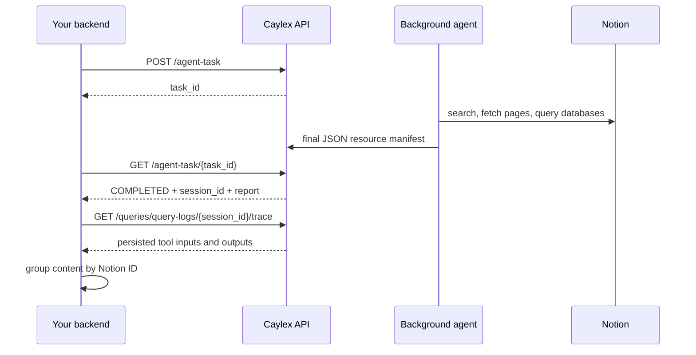

This recipe uses a [background agent task](/background-tasks/agent-tasks) to
discover and read Notion content, then turns the task's persisted tool inputs and
outputs into clean JSON for a search index, RAG pipeline, or local knowledge
base.

The agent decides what to discover and fetch. After it finishes, your
application uses the task's `session_id` to download the complete tool trace and
groups those responses by stable Notion page ID.

<Card title="Full cookbook source" icon="github" href="https://github.com/caylex-ai/caylex-cookbooks/tree/main/background-agent-file-sync">
  View the complete scripts, tests, and usage guide in the public
  `caylex-ai/caylex-cookbooks` repository.
</Card>

## How it works



The final manifest tells the exporter which resources the agent intentionally
selected. The trace supplies the actual page bodies, database rows, and
comments returned by Notion.

## Endpoints used

| Method & path | Purpose |
| --- | --- |
| `POST /api/v1/agent-task` | Launch the file-discovery task with a prompt and optional `skill_ref`. |
| `GET /api/v1/agent-task/{task_id}` | Poll status and retrieve the completed `report` and `session_id`. |
| `GET /api/v1/queries/query-logs/{session_id}/trace` | Read the paginated downstream tool inputs and outputs. |

## Before you start

You need:

- a server-side [platform access token](/auth/platform-authentication);
- the navigator API key (`ck_…`) for the project whose Notion connection the
  agent should use;
- the connected user's email; and
- optionally, a project or global [skill](/platform/projects) that instructs the
  agent how to discover, fetch, and report resources.

<Warning>
The trace can contain complete customer documents and database rows. Keep the
platform token and generated files server-side, store exports securely, and do
not commit task output or raw traces to source control.
</Warning>

## Manifest contract

The exporter looks for the first JSON object beginning with
`{"schema_version":"1.0"` in the task report. This remains reliable even if the
agent accidentally writes a short explanation before its JSON.

Your prompt or skill should require this minimum shape:

```json
{
  "schema_version": "1.0",
  "source": "notion",
  "fetched_resources": [
    {
      "title": "Customer Readiness",
      "type": "page",
      "id": "stable-notion-page-id",
      "url": "https://app.notion.com/..."
    }
  ],
  "unresolved_requests": []
}
```

Only include a resource after the agent successfully calls `notion-fetch`.
Search results alone do not contain the substantive file content.

## The procedure

<Steps>
  <Step title="Configure credentials">
    Keep all credentials in environment variables:

    ```bash
    export CAYLEX_PLATFORM_TOKEN="your_platform_access_token"
    export CAYLEX_API_KEY="ck_your_navigator_api_key"
    export CAYLEX_USER_EMAIL="user@example.com"
    ```
  </Step>
  <Step title="Launch and capture the task">
    Run the task lifecycle script with a prompt and optional skill reference.
    Read-only sync tasks should use `approval_mode: "exclude"`.

    ```bash
    python3 run_background_file_sync.py \
      --prompt "Find and fetch every Notion page related to customer readiness." \
      --skill-ref "your-notion-sync-skill" \
      --approval-mode exclude \
      --output-dir run-output
    ```

    The script waits for a terminal status and saves `submission.json`,
    `task-status.json`, and `raw-trace.json`.
  </Step>
  <Step title="Build the resource-centric export">
    Pass the captured task response and trace into the exporter:

    ```bash
    python3 export_notion_sync.py \
      --task-status-file run-output/task-status.json \
      --trace-file run-output/raw-trace.json \
      --output output/notion-files.json
    ```
  </Step>
  <Step title="Load files into your index">
    Iterate through `files`. Use each stable `id` as the source key, `content`
    as the primary page body, and preserve database queries and comments as
    related content with their provenance.
  </Step>
</Steps>

## What the runner does

The lifecycle runner submits a request shaped like:

```python
payload = {
    "caylex_api_key": os.environ["CAYLEX_API_KEY"],
    "user_email": os.environ["CAYLEX_USER_EMAIL"],
    "prompt": prompt,
    "skill_ref": skill_ref,
    "approval_mode": "exclude",
}
```

It then polls `GET /agent-task/{task_id}` until `COMPLETED`, `INCOMPLETE`, or
`FAILED`. Once `session_id` is available, it downloads every trace page with
`limit=100`.

<Card title="View run_background_file_sync.py" icon="code" href="https://github.com/caylex-ai/caylex-cookbooks/blob/main/background-agent-file-sync/run_background_file_sync.py">
  Full submission, polling, pagination, timeout, and error-handling example.
</Card>

## How tool responses are grouped

Every manifest resource is matched to a successful `notion-fetch` input using a
normalized Notion UUID. This deduplicates repeated fetch attempts while
retaining the contributing tool-call IDs.

Some nested resources require an additional relationship:

- **Child pages** — `<page url="…">` references are recorded under
  `related_resources`; fetched children remain separate files with their own
  IDs.
- **Databases** — `collection://…` data-source URLs from a database fetch are
  matched to `notion-query-data-sources` or `notion-query-database-view` inputs.
  The query response is attached to the canonical database file.
- **Rows** — page URLs returned by database queries are preserved in
  `row_links`. If the agent fetched a row page, it also appears as its own file.
- **Comments** — `notion-get-comments` responses are attached using the input
  `page_id`.

If a relationship is missing or ambiguous, the exporter records it under
`unmatched_tool_calls` instead of guessing.

<Card title="View export_notion_sync.py" icon="code" href="https://github.com/caylex-ai/caylex-cookbooks/blob/main/background-agent-file-sync/export_notion_sync.py">
  Full manifest extraction, ID normalization, lineage, and output-generation
  example.
</Card>

## Output shape

```json
{
  "schema_version": "1.0",
  "source": "notion",
  "task_id": "...",
  "session_id": "...",
  "files": [
    {
      "id": "...",
      "name": "Customer Readiness",
      "link": "https://app.notion.com/...",
      "type": "page",
      "content": "...",
      "related_resources": [],
      "database_queries": [],
      "comments": [],
      "fetch_tool_call_ids": []
    }
  ],
  "unresolved_requests": [],
  "unmatched_tool_calls": []
}
```

Database responses remain structured under `database_queries` rather than
being concatenated into the page body. This makes it possible to update,
re-embed, or audit page content and database rows independently.

## Scope and extensions

The cookbook covers pages, child pages, databases/data sources, rows, and
comments. Meeting transcripts and file attachments need additional collection
logic:

- fetch meeting-note pages with `include_transcript: true`; and
- download signed attachment URLs promptly, then apply the appropriate text,
  PDF, image, or OCR parser.

Add those only when your indexing use case needs them because they can
substantially increase trace size and processing cost.
