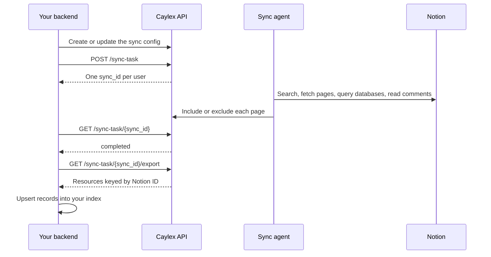

This recipe collects a Notion workspace area, such as an engineering wiki and
its sub-pages, as each of your users, and saves one JSON export per user. You
describe what to collect in plain language; a sync agent crawls Notion and
records which pages belong in the sync. Caylex then exports those pages exactly
as Notion returned them.

## How it works


```mermaid
sequenceDiagram
    participant App as Your backend
    participant Caylex as Caylex API
    participant Agent as Sync agent
    participant Notion as Notion

    App->>Caylex: Create or update the sync config
    App->>Caylex: POST /sync-task
    Caylex-->>App: One sync_id per user
    Agent->>Notion: Search, fetch pages, query databases, read comments
    Agent->>Caylex: Include or exclude each page
    App->>Caylex: GET /sync-task/{sync_id}
    Caylex-->>App: completed
    App->>Caylex: GET /sync-task/{sync_id}/export
    Caylex-->>App: Resources keyed by Notion ID
    App->>App: Upsert records into your index
```

The agent runs as each user, with that user's Notion connection, so every
export contains only the pages that user can see.

## Before you start

You need:

- the **Background Sync** toggle turned on under **Administration > Premium
  Features** in the Caylex Platform (tenant admins only);
- a project with the Notion server from the Caylex catalog;
- users who've connected their Notion account to that project; and
- a server-side [platform access token](/auth/platform-authentication), sent
  as `Authorization: Bearer <token>`.

[Check user access](/background-tasks/background-sync#3-check-user-access)
before the first run. A user who hasn't connected Notion is skipped when you
trigger.

<Warning>
Exports contain complete Notion pages, database rows, and comments. Keep the
platform token and every export server-side, apply your normal retention
controls, and never commit exports to source control.
</Warning>

## Run the sync

<Steps>
  <Step title="Set credentials">
    ```bash
    export CAYLEX_PLATFORM_TOKEN="your_platform_access_token"
    export CAYLEX_PROJECT_ID="your_project_id"
    ```
  </Step>
  <Step title="Find the Notion server">
    `GET /sync-configs/sources?project_id=...` lists the project's servers that
    Background Sync supports. Pick the one whose `source_type` is `notion` and
    keep its `server_instance_id`. If Notion isn't listed, the server is paused
    or missing from the project.
  </Step>
  <Step title="Create or update the sync config">
    Look for a config with your name in `GET /sync-configs?project_id=...`.
    Update it with `PUT /sync-configs/{id}` if it exists, or create it with
    `POST /sync-configs`. This keeps the script safe to re-run and lets you edit
    the instructions in code.
  </Step>
  <Step title="Trigger the sync">
    `POST /sync-task` with the config ID starts one run per user. Log the
    `skipped` users and their `reason`, then reconnect them and trigger again.
  </Step>
  <Step title="Wait for each run">
    Poll `GET /sync-task/{sync_id}` until `status` is `completed`, `incomplete`,
    or `failed`. A large wiki can take several minutes.
  </Step>
  <Step title="Download the export">
    Page through `GET /sync-task/{sync_id}/export` with `limit=500`. If
    `engine_version` changes between pages, start again from `offset=0`,
    because pages from different engine versions can't be mixed.
  </Step>
</Steps>

## The script

This script runs every step for a fixed list of users and writes each run's
export to `output/`. It needs Python 3.10+ and `httpx`.

```python notion_sync.py
import json
import os
import sys
import time
from pathlib import Path

import httpx

PROJECT_ID = os.environ["CAYLEX_PROJECT_ID"]
CONFIG_NAME = "Notion engineering wiki"
INSTRUCTIONS = (
    "Start from the Engineering Wiki page and collect it and every page nested "
    "under it, with full content. Include the Team Directory database and its "
    "rows. Include page comments. Skip anything under Archive."
)
USER_EMAILS = ["alex@example.com", "sam@example.com"]
FINISHED = {"completed", "incomplete", "failed"}

client = httpx.Client(
    base_url="https://api.caylex.ai/api/v1",
    headers={"Authorization": f"Bearer {os.environ['CAYLEX_PLATFORM_TOKEN']}"},
    timeout=120,
)


def call(method: str, path: str, **kwargs) -> dict:
    response = client.request(method, path, **kwargs)
    response.raise_for_status()
    return response.json()


def notion_server_id() -> str:
    sources = call("GET", "/sync-configs/sources", params={"project_id": PROJECT_ID})
    notion = [s for s in sources["sources"] if s["source_type"] == "notion"]
    if len(notion) != 1:
        sys.exit(f"Expected one syncable Notion server, found {len(notion)}")
    return notion[0]["server_instance_id"]


def find_config() -> dict | None:
    params = {"project_id": PROJECT_ID, "size": 100}
    while True:
        page = call("GET", "/sync-configs", params=params)
        for config in page["items"]:
            if config["name"] == CONFIG_NAME:
                return config
        if not page["meta"]["next_cursor"]:
            return None
        params["cursor"] = page["meta"]["next_cursor"]


def ensure_config() -> str:
    body = {
        "name": CONFIG_NAME,
        "instructions": INSTRUCTIONS,
        "server_instance_ids": [notion_server_id()],
        "all_users": False,
        "user_emails": USER_EMAILS,
    }
    existing = find_config()
    if existing:
        return call("PUT", f"/sync-configs/{existing['id']}", json=body)["id"]
    return call("POST", "/sync-configs", json={"project_id": PROJECT_ID, **body})["id"]


def wait_for(sync_id: str) -> dict:
    while True:
        run = call("GET", f"/sync-task/{sync_id}")
        if run["status"] in FINISHED:
            return run
        time.sleep(15)


def download_export(sync_id: str) -> dict:
    export, offset = None, 0
    while True:
        page = call("GET", f"/sync-task/{sync_id}/export", params={"offset": offset, "limit": 500})
        if export is not None and page["engine_version"] != export["engine_version"]:
            export, offset = None, 0
            continue
        if export is None:
            export = page
        else:
            export["resources"].extend(page["resources"])
        if page["page"]["next_offset"] is None:
            return export
        offset = page["page"]["next_offset"]


def main(since: str | None = None) -> None:
    body = {"sync_config_id": ensure_config()}
    if since:
        body["since"] = since
    trigger = call("POST", "/sync-task", json=body)
    for skip in trigger["skipped"]:
        print(f"Skipped {skip['user_email']}: {skip['reason']}")

    out = Path("output")
    out.mkdir(exist_ok=True)
    for run in trigger["runs"]:
        status = wait_for(run["sync_id"])
        export = download_export(run["sync_id"])
        path = out / f"notion-{run['sync_id']}.json"
        path.write_text(json.dumps(export, ensure_ascii=False, indent=2))
        print(f"{run['user_email']}: {status['status']}, "
              f"{len(export['resources'])} resources -> {path}")


if __name__ == "__main__":
    main(since=sys.argv[1] if len(sys.argv) > 1 else None)
```

Run it with no arguments for a full sync, or pass an ISO 8601 timestamp to
collect only pages modified since then:

```bash
python notion_sync.py
python notion_sync.py 2026-09-01T00:00:00Z
```

## Write instructions for Notion

The agent searches Notion, or starts from the pages and databases your
instructions name. It then follows sub-pages and inline databases
that your instructions cover. Good Notion instructions:

- **Name a starting point.** "Start from the Engineering Wiki page" or "Collect
  the Onboarding teamspace" gives the crawl a clear root. Without one, the agent
  searches and decides page by page.
- **Say how deep to go.** "Every page nested under it" follows the full tree;
  "only its direct sub-pages" stops one level down.
- **Ask for databases explicitly.** The agent reads database rows only when your
  instructions cover them. Each row is also a page, but the agent fetches a row's
  body only when you ask for it, because every page it reads counts toward the
  source's iteration limit.
- **Ask for comments if you want them.** The agent reads comments only when
  your instructions ask for them.
- **List exclusions.** "Skip anything under Archive" is recorded as an exclusion
  with a reason you can audit in the export's `excluded` list.

See [Writing good instructions](/background-tasks/background-sync#writing-good-instructions)
for general guidance.

## What the export contains

Most Notion resources are pages or databases:

| `type` | Content | Relations | Attachments |
| --- | --- | --- | --- |
| `page` | The page in Notion's enhanced Markdown. | `parent`, plus `child` for each sub-page and inline database. | `comments`, when the agent read them. |
| `database` | The database page: its title, schema, and views. | `parent`, `child`, `row` for each row page, and `embeds` for each data source. | `rows`, one per distinct query. |

A third type, `data_source`, appears when the agent reaches a database's data
source directly, for example from a search result. Rows from a data source
attach to the database that embeds it whenever that database is in the export.

`content.format` is `notion_markdown`, and `content.text` is the page exactly
as Notion returned it. That includes Notion's own preamble and its tags,
such as `<page url="...">` for sub-pages and `<database url="...">` for inline
databases. Strip or render those tags before you index the text.

A page looks like this. The content and IDs are trimmed:

```json
{
  "key": "notion:11111111-1111-1111-1111-111111111111:1f0a2b3c4d5e4f60a1b2c3d4e5f60718",
  "source": "notion",
  "native_id": "1f0a2b3c4d5e4f60a1b2c3d4e5f60718",
  "type": "page",
  "title": "Engineering Handbook",
  "url": "https://app.notion.com/p/1f0a2b3c4d5e4f60a1b2c3d4e5f60718",
  "modified_at": "2026-08-30T17:20:00Z",
  "content": { "format": "notion_markdown", "text": "<page url=\"...\">\n# Engineering Handbook\n..." },
  "content_status": "available",
  "relations": [
    { "kind": "child", "target_key": "notion:1111...:2a1b...", "resolved": true },
    { "kind": "child", "target_key": "notion:1111...:4c2d...", "resolved": true }
  ],
  "attachments": [
    {
      "kind": "comments",
      "complete": true,
      "data": {
        "discussions": [
          { "id": "discussion://1f0a/blk/d1", "comments": [{ "author": "user-1", "text": "Should we add an on-call section?" }] }
        ]
      }
    }
  ],
  "content_hash": "sha256:..."
}
```

A database carries its rows as Notion returned them, one object per row, with
the row page's `url`:

```json
{
  "key": "notion:1111...:4c2d3e4f5a6b4c7d8e9f0a1b2c3d4e5f",
  "type": "database",
  "title": "Team Directory",
  "relations": [
    { "kind": "parent", "target_key": "notion:1111...:1f0a...", "resolved": true },
    { "kind": "embeds", "target_key": "notion:1111...:5d3e...", "resolved": false },
    { "kind": "row", "target_key": "notion:1111...:7f5a...", "resolved": false }
  ],
  "attachments": [
    {
      "kind": "rows",
      "complete": true,
      "data": [
        { "Name": "Member A", "Team": "Platform", "url": "https://app.notion.com/7f5a..." },
        { "Name": "Member B", "Team": "Data", "url": "https://app.notion.com/8a6b..." }
      ]
    }
  ]
}
```

A few details to handle:

- **Each query is its own `rows` attachment.** If the agent queried a database
  twice with different filters, you get two attachments. Paginated results of
  one query are merged into a single attachment. `complete` is `true` only when
  the agent read every page of that query's results.
- **Row pages appear as resources only when fetched.** Otherwise a `row`
  relation has `resolved: false`, and the row's properties live only in the
  `rows` attachment.
- **`partial` means Notion truncated the page.** The export keeps the text that
  Notion returned.
- **`resolved: false`** means the agent never found the target, for example a
  sub-page outside your instructions.

## Build index records

This function turns one user's export into flat records. It keys each record on
`key`, keeps the parent for breadcrumbs, and folds rows and comments into the
record. Overlapping queries can return the same row twice, so rows are deduped
by their `url`:

```python
import json


def unique_rows(attachments: list[dict]) -> list[dict]:
    rows: dict[str, dict] = {}
    for attachment in attachments:
        if attachment["kind"] == "rows":
            for row in attachment["data"]:
                rows.setdefault(row.get("url") or json.dumps(row, sort_keys=True), row)
    return list(rows.values())


def to_records(export: dict, user_email: str) -> list[dict]:
    records = []
    for resource in export["resources"]:
        if resource["content_status"] not in ("available", "partial"):
            continue
        attachments = resource["attachments"]
        records.append({
            "id": resource["key"],
            "type": resource["type"],
            "title": resource["title"],
            "url": resource["url"],
            "text": resource["content"]["text"],
            "parent_id": next(
                (r["target_key"] for r in resource["relations"] if r["kind"] == "parent"),
                None,
            ),
            "rows": unique_rows(attachments),
            "comments": [a["data"] for a in attachments if a["kind"] == "comments"],
            "truncated": resource["content_status"] == "partial",
            "content_hash": resource["content_hash"],
            "visible_to": [user_email],
        })
    return records
```

When you load records from several users, merge them by `id` and union
`visible_to`. Skip the write when the stored `content_hash` matches.

## Incremental syncs

Pass `since` to keep only pages Notion reports as modified after that time.
Notion doesn't report a last-edited time for every page, though, so many
resources have `modified_at: null`. With `since` set, those resources are
dropped and counted in the source's `skipped_unchanged`, even if they changed.

For Notion, run full syncs on a schedule and use `content_hash` to skip
unchanged pages. If you do use `since`, check `skipped_unchanged` against the
number of pages you expected, and run a full sync periodically to catch up.

## Troubleshooting

| What you see | What to do |
| --- | --- |
| A user is in `skipped` with `not_accessible` | [Check user access](/background-tasks/background-sync#3-check-user-access). `not_authenticated` means the user must connect Notion through the project's auth link; the admin statuses mean a project or tenant admin has to set up the server. Then trigger again. |
| Source status `authentication_required` | The agent reported that Notion asked the user to sign in again. Have them reconnect, then trigger again. |
| Source status `no_results` | The agent found nothing your instructions cover. [Read the transcript](/background-tasks/background-sync#read-a-transcript) to see what it searched for, then name a clearer starting page. |
| Run status `incomplete` | The agent ran out of iterations or didn't finish deciding. [Continue the run](/background-tasks/background-sync#continue-a-run) with a message such as "Continue with the remaining sub-pages." |
| Entries in `undecided` | The agent read pages without deciding whether they belong. Tighten the instructions so every page it reads clearly falls in or out. |
| `skipped_unchanged` is high with `since` | Pages without a last-edited time were dropped. See [Incremental syncs](#incremental-syncs). |
