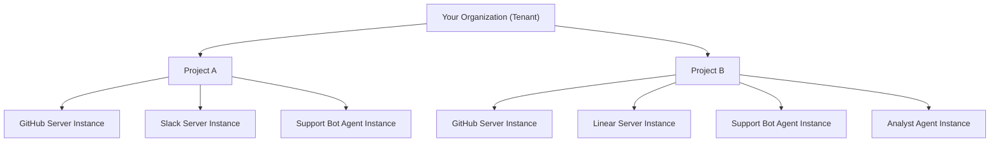

Caylex organizes your agents, servers, and permissions into a few key concepts. Understanding these concepts is essential for setting up your deployment.

## Projects

A **Project** represents a deployment of your agent system. Think of each project as:

- A deployment for a specific customer
- A deployment for a specific team in your company
- A separate environment (staging, production)

Each project contains:

- **Server Instances** — which MCP servers are connected
- **Agent Instances** — which agents are deployed
- **User Auth Credentials** — authentication credentials that agents use to connect with external services on behalf of users

Projects provide **complete isolation** — each one has independent configurations, credentials, and permissions.

## Servers and Server Instances

### Server

A **Server** is a reusable definition of an MCP server. It defines:

- The endpoint URL and transport type (Streamable HTTP or SSE)
- The authentication method (OAuth, Header, Path, Query, or No Auth)
- The tools that the server exposes

Servers can come from the **Caylex Catalog** (pre-configured servers like GitHub, Slack, Linear, and Notion) or be added as **custom servers** that you manage.

### Server Instance

A **Server Instance** is a Server connected to a specific Project. It:

- Links a Server to your Project
- Has project-specific authentication credentials
- Can be paused or activated independently per project
- Allows the same Server to be used across multiple Projects with different configurations

<Info>
**Example:** You connect the GitHub MCP to your "Customer A" project with one set of credentials and to your "Customer B" project with different credentials. That creates two Server Instances of the same Server.
</Info>

## Agents and Agent Instances

### Agent Identity

An **Agent Identity** is the definition or template of an agent. It defines the agent's name and purpose. Examples: "Customer Support Bot", "Data Analyst Agent", "Code Review Assistant".

### Agent Instance

An **Agent Instance** is an Agent Identity deployed in a specific Project. It:

- Links an Agent Identity to a Project
- Has its own **API key** for authentication
- Can have **tool restrictions** (block specific tools for this deployment)
- Can have **server restrictions** (block entire servers for this deployment)
- Allows the same agent to be deployed across multiple Projects with different permissions

<Info>
**Example:** You deploy your "Support Bot" agent to "Customer A" with full tool access and to "Customer B" with restricted access to sensitive tools. That creates two Agent Instances of the same Agent Identity.
</Info>

## How they work together

When your agent connects to Caylex, two pieces of information identify the context:

1. **API Key** (`x-api-key` header) — identifies the Agent Instance, which tells Caylex which Project the request belongs to
2. **User Email** (`x-user-email` header) — identifies the end user interacting with the agent

This gives Caylex the context needed to:

- Show only the tools available to that agent in that project
- Apply any tool or server restrictions configured for that agent
- Use the right authentication credentials for each MCP server (based on the user's email for user-level auth)
- Track usage and provide per-user analytics

<Tip>
This architecture gives you enterprise-grade multi-tenancy with fine-grained access control. Each project is fully isolated, so you can safely deploy the same agents and servers across different customers or teams.
</Tip>

## What's next

<CardGroup cols={2}>
  <Card title="Create a Project" icon="folder" href="/platform/projects">
    Set up your first project and configure it.
  </Card>
  <Card title="Add Servers" icon="server" href="/platform/servers">
    Connect servers from the catalog or add your own.
  </Card>
  <Card title="Configure Agents" icon="robot" href="/platform/agents">
    Create agents and set up tool permissions.
  </Card>
  <Card title="Connect Your Agent" icon="plug" href="/integration/connecting">
    Integrate Caylex with your agent framework.
  </Card>
</CardGroup>
