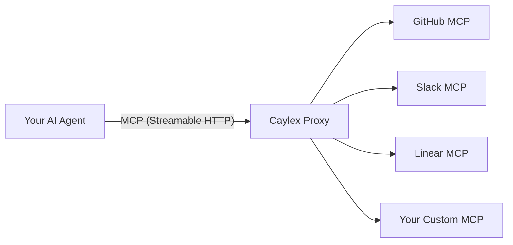

The Caylex Proxy is the core of the platform. It is an MCP server that sits between your AI agents and all of your connected MCP servers, adding intelligence, security, and observability to every tool interaction.

Your agent connects to a **single endpoint** — the Caylex Proxy — and gains access to tools across all servers in its project. The proxy handles tool discovery, authentication, execution, and analytics automatically.

## How it works

1. Your agent connects to the Caylex Proxy at `https://proxy.caylex.ai/mcp` using Streamable HTTP transport
2. The proxy identifies the agent and project from the `x-api-key` header, and the user from the `x-user-email` header
3. The proxy exposes MCP tools that your agent uses to discover and execute tools across all connected servers
4. When your agent invokes a tool, the proxy automatically injects the correct credentials for that user and server, executes the call, and returns the result
5. Every interaction is logged for analytics and debugging

## The proxy's MCP tools

The Caylex Proxy exposes up to 4 MCP tools to your agent, depending on your [Agent Instance configuration](/platform/agents):

### `suggest_tools`

Recommends the most relevant tools based on your agent's intent. Your agent describes what it wants to accomplish, and the proxy returns a ranked list of tools with descriptions and relevance scores.

This tool is available when **Dynamic Suggestions** is enabled on the Agent Instance.

<Card title="Tool Suggestions" icon="wand-magic-sparkles" href="/proxy/tool-suggestions">
  Learn how intelligent tool suggestions work.
</Card>

### `get_tool_schemas`

Retrieves the input schemas for one or more tools. After your agent selects tools (from suggestions or direct knowledge), it calls this tool to get the parameter schemas needed to invoke them.

Schemas are fetched in parallel across multiple servers for efficiency.

### `invoke_tools`

Executes one or more tool calls in parallel. Your agent provides the tool name, server name, parameters, and an intent description. The proxy:

- Looks up the correct server and tool
- Retrieves and injects the user's credentials automatically
- Executes the tool call on the external MCP server
- Returns the result (or an enriched error message)

Multiple tool calls are executed in parallel for performance.

### `get_context_map`

Returns a semantic overview of what information exists across all connected servers. This helps your agent understand where data lives before making queries.

This tool is available when **Context Maps** is enabled on the Agent Instance.

<Card title="Context Maps" icon="map" href="/proxy/context-maps">
  Learn how Context Maps help agents navigate information.
</Card>

## Automatic authentication

One of the proxy's key capabilities is **automatic credential injection**. When your agent invokes a tool, the proxy:

1. Identifies which server the tool belongs to
2. Looks up the user's authentication credentials for that server (based on the `x-user-email` header)
3. Injects the credentials into the request (OAuth token, API key, path/query parameters — depending on the server's auth method)
4. Connects to the external MCP server and executes the tool

Your agent never needs to handle credentials directly. The proxy manages the entire authentication flow transparently.

<Note>
For this to work, the user identified by `x-user-email` must have previously authenticated with the server through an [Auth Link](/auth/auth-links). If the user has not authenticated, tool calls to that server will return an authentication error.
</Note>

## Error recovery

When a tool call fails, the proxy enhances the error message with **historical context**. It retrieves examples of previous successful calls to the same tool, including:

- The parameters that were used
- A truncated version of the successful result

This context helps your agent understand what a correct call looks like and self-correct on the next attempt.

## Observability

Every interaction through the proxy is tracked:

- **Sessions** — each agent session is logged with all tool calls
- **Tool call metrics** — latency, success/failure, error types
- **User activity** — which users are using which tools

See [Analytics](/analytics/overview) for details on monitoring your agent deployments.
