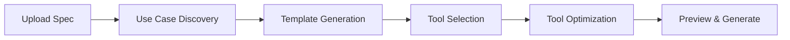

Server Foundry lets you turn any API into a production-ready MCP server. Upload an OpenAPI specification (or Postman collection), and the AI-powered **Designer Agent** guides you through selecting endpoints, optimizing tool definitions, and deploying a fully functional MCP server — all from within the Caylex platform.

## When to use Server Foundry

Server Foundry is for when you have an API that is not available in the [Caylex Catalog](/platform/servers) and you want to make it accessible to your AI agents through MCP.

Common use cases:

- **Internal APIs** — expose your company's internal services to AI agents
- **Third-party APIs** — connect APIs from vendors that do not yet have MCP servers
- **Custom integrations** — build tailored MCP servers with only the endpoints your agents need

## What you get

When you complete the Server Foundry workflow, Caylex generates:

- A **production-ready MCP server** deployed and managed by Caylex
- **Optimized tool definitions** with names and descriptions tuned for AI agent consumption
- **Authentication handling** built in (header-based or OAuth)
- A server that appears in your **Servers** list, ready to be connected to any project

## How it works

Server Foundry uses the **MCP Designer Agent** — an AI assistant that guides you through a 5-phase workflow:

1. **Upload** — provide your OpenAPI spec
2. **Use Case Discovery** — the agent analyzes your API and identifies use cases
3. **Template Generation** — the agent creates workflow templates grouping related endpoints
4. **Tool Selection** — you choose which tools to include
5. **Tool Optimization** — the agent optimizes tool names and descriptions for AI agents
6. **Preview & Generate** — review the final configuration and deploy

Each phase combines AI guidance with your control. The agent suggests, you confirm. You can always override the agent's recommendations.

<Card title="Step-by-step guide" icon="list-check" href="/server-foundry/building-a-server">
  Walk through the complete Server Foundry workflow from upload to deployment.
</Card>

## The workspace

Server Foundry uses a split-screen workspace:

- **Left panel** — a chat interface where you converse with the Designer Agent
- **Right panel** — a dynamic workspace that shows different views for each phase (use cases, template selector, tool optimizer, server preview)
- **Top bar** — a progress navigator showing your current phase and completion status

Your workspace is **automatically saved**. You can leave and return to any in-progress session from the **Saved Workspaces** drawer.
