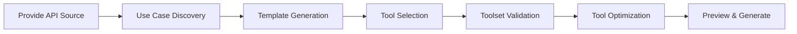

Server Foundry lets you turn any API into a production-ready MCP server. The AI-powered **Designer Agent** guides you through selecting endpoints, optimizing tool definitions, and deploying a fully functional MCP server — all from within the Caylex platform.

The goal of Server Foundry is to massively expand the surface area of what you can build an MCP server from — empowering your agents to interact with any external system.

## Input methods

Server Foundry supports multiple ways to get started, so you can build an MCP server regardless of how your API is documented:

<AccordionGroup>
  <Accordion title="OpenAPI specification">
    Upload an OpenAPI spec file (JSON or YAML). The Designer Agent parses the spec, extracts all endpoints and schemas, and guides you through selecting and optimizing the tools.
  </Accordion>
  <Accordion title="Postman Collection">
    Upload a Postman Collection file. The Designer Agent converts the collection's requests into MCP tool definitions, preserving headers, parameters, and request bodies.
  </Accordion>
  <Accordion title="API documentation URL">
    Provide the URL of an API's documentation site. Caylex crawls the documentation pages and extracts API endpoints automatically. You review and approve all discovered pages before the Designer Agent proceeds with generation.
  </Accordion>
  <Accordion title="Browser workflow recording (coming soon)">
    Use Caylex's browser extension to record your workflows on any web app. Caylex extracts the underlying network requests and builds an MCP server from the derived API calls — no spec or documentation required.
  </Accordion>
</AccordionGroup>

## When to use Server Foundry

Server Foundry is for when you have an API that is not available in the [Caylex Catalog](/platform/servers) and you want to make it accessible to your AI agents through MCP.

Common use cases:

- **Internal APIs** — expose your company's internal services to AI agents
- **Third-party APIs** — connect APIs from vendors that do not yet have MCP servers
- **Custom integrations** — build tailored MCP servers with only the endpoints your agents need
- **Undocumented APIs** — use the browser extension (coming soon) to capture API calls from any web app, even those without formal documentation

## What you get

When you complete the Server Foundry workflow, Caylex generates:

- A **production-ready MCP server** deployed and managed by Caylex
- **Optimized tool definitions** with names and descriptions tuned for AI agent consumption
- **Authentication handling** built in (header-based or OAuth)
- A server that appears in your **Servers** list, ready to be connected to any project

## How it works

Server Foundry uses the **MCP Designer Agent** — an AI assistant that guides you through a multi-phase workflow:

```mermaid
graph LR
    Upload["Provide API Source"] --> Discovery["Use Case Discovery"]
    Discovery --> Templates["Template Generation"]
    Templates --> Selection["Tool Selection"]
    Selection --> Validation["Toolset Validation"]
    Validation --> Optimization["Tool Optimization"]
    Optimization --> Preview["Preview & Generate"]
```

1. **Provide API source** — upload a spec, provide a documentation URL, or import a Postman collection
2. **Use Case Discovery** — the agent analyzes your API and identifies use cases
3. **Template Generation** — the agent creates workflow templates grouping related endpoints
4. **Tool Selection** — you choose which tools to include
5. **Toolset Validation** — Caylex validates that all selected tools can be sequenced into usable workflows by mapping input/output dependencies across endpoints (e.g., ensuring an endpoint that requires an ID has a corresponding endpoint to discover that ID)
6. **Tool Optimization** — the agent optimizes tool names and descriptions for AI agents
7. **Preview & Generate** — review the final configuration and deploy

Each phase combines AI guidance with your control. The agent suggests, you confirm. You can always override the agent's recommendations.

<Card title="Step-by-step guide" icon="list-check" href="/server-foundry/building-a-server">
  Walk through the complete Server Foundry workflow from upload to deployment.
</Card>

## The workspace

Server Foundry uses a split-screen workspace:

- **Left panel** — a chat interface where you converse with the Designer Agent
- **Right panel** — a dynamic workspace that shows different views for each phase (use cases, template selector, tool optimizer, server preview)
- **Top bar** — a progress navigator showing your current phase and completion status

Your workspace is **automatically saved**. You can leave and return to any in-progress session from the **Saved Workspaces** drawer.
