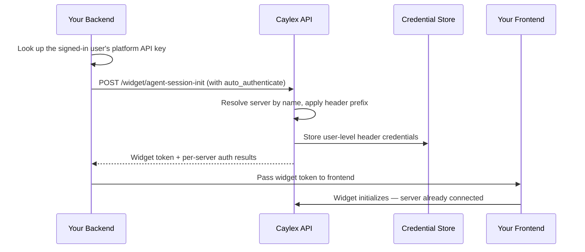

When you embed a Caylex widget in your SaaS application, the user is already signed in to your platform. Asking them to *also* authenticate the agent into your platform's own MCP server is a confusing, redundant step — they are being asked to log in to a product they are already using, and most users do not even know what their API key is.

**Auto-authentication** removes that step. Your backend already knows who the signed-in user is and can look up their credential, so it submits that credential to Caylex when it mints the widget token. The agent is then connected to your platform's MCP server the moment the widget opens, with no auth flow shown to the user.

The most common use is connecting the user to **your own platform's** MCP server, but the same mechanism works for any **internal** integration whose per-user credential your backend can look up on the user's behalf.

## Overview

Auto-authentication persists a user's credentials for a **user-level header-auth** server as part of the widget token-mint call. Because it runs before the widget initializes, the server shows up as already connected in the chat widget's Connected Services panel and the agent can call its tools immediately.

It is designed for the common case where:

- The user is already logged in to your SaaS platform.
- Your backend can look up that user's API key or token on their behalf.
- The integration's MCP server uses **header authentication** (for example, an `Authorization: Bearer <token>` header).

This is specifically for integrations where you control the credential. For third-party services the user must authorize themselves (Google, Slack, and so on), use the standard [auth link flow](/auth/auth-links) instead.

<Note>
Auto-authentication only applies to **user-level**, **header-auth** servers. OAuth, cookie auth, and URL-parameter auth are not supported, and project-level credentials must still go through the standard [auth link flow](/auth/auth-links). Header auth is the most common programmatic access method, so it covers the typical "connect the user to our own API" case.
</Note>

## How It Works

Auto-authentication is an optional extension of the same `POST /widget/agent-session-init` call you already make to embed a widget. You do not call a separate endpoint.



<Steps>
  <Step title="Look up the user's credential on your backend">
    Your backend already knows which user is signed in, so it can fetch that user's API key or token for your platform.
  </Step>
  <Step title="Include an auto_authenticate payload when minting the token">
    Add the `auto_authenticate` object to your existing session-init request, naming the target server and supplying the raw header value(s).
  </Step>
  <Step title="Caylex stores the credentials before the widget loads">
    Caylex resolves the server, applies any configured header prefix, and persists the user-level credentials. The mint response includes per-server results.
  </Step>
</Steps>

<Warning>
The mint endpoint must be called from your backend with a platform access token. Never expose your platform access token, navigator API key, or your users' credentials to the browser.
</Warning>

## Prerequisites

- A working widget integration. See [Embedded Widgets](/widget/overview) first.
- A **user-level header-auth** server set up in your project. The header name(s) and any prefix (such as `Bearer `) are configured when the server is onboarded — auto-authentication reuses that configuration and never changes it.
- A **User Email** for the signed-in user. This is required whenever `auto_authenticate` is present.
- The ability to look up the user's platform credential on your backend.

<Note>
Auto-authentication does **not** configure a server's auth settings — it only saves a user's credentials for a server that is already configured for header auth. Set up the header name and prefix when you onboard the server.
</Note>

## Request Shape

Add an optional `auto_authenticate` object to your `POST /widget/agent-session-init` body:

```json
{
  "caylex_api_key": "ck_your_navigator_api_key",
  "user_email": "jane@example.com",
  "auto_authenticate": {
    "force": false,
    "servers": [
      {
        "server_name": "ShopPilot API",
        "headers": [
          { "header_name": "Authorization", "header_value": "the-users-raw-token" }
        ]
      }
    ]
  }
}
```

| Field | Required | Description |
| --- | --- | --- |
| `auto_authenticate.force` | No (default `false`) | When `true`, replace any existing credentials for this user and server. See [Idempotency and Rotation](#idempotency-and-rotation). |
| `auto_authenticate.servers` | Yes | One or more servers to authenticate. At least one is required. |
| `servers[].server_name` | Yes | The server's **display name** as it appears in the Caylex platform. Matched case-insensitively (see [Server Name](#server-name)). |
| `servers[].headers` | Yes | One or more header values to store. At least one is required. |
| `headers[].header_name` | Yes | The header name, matching the server's configured header (case-insensitive). |
| `headers[].header_value` | Yes | The **raw** credential value. Do not include the configured prefix — Caylex adds it. See [Header Values and Prefixes](#header-values-and-prefixes). |

## Step 1: Mint A Token With Auto-Authentication

Extend your existing backend mint endpoint to include the `auto_authenticate` payload. Your backend looks up the signed-in user's platform token and passes it through.

<Tabs>
  <Tab title="Python">
    ```python token.py
    import httpx

    CAYLEX_API_URL = "https://api.caylex.ai/api/v1/"
    PLATFORM_TOKEN = "your_platform_access_token"
    CAYLEX_API_KEY = "ck_your_navigator_api_key"

    async def mint_widget_token(user_email: str, user_platform_token: str) -> dict:
        async with httpx.AsyncClient() as client:
            response = await client.post(
                f"{CAYLEX_API_URL}widget/agent-session-init",
                headers={"Authorization": f"Bearer {PLATFORM_TOKEN}"},
                json={
                    "caylex_api_key": CAYLEX_API_KEY,
                    "user_email": user_email,
                    "auto_authenticate": {
                        "force": False,
                        "servers": [
                            {
                                "server_name": "ShopPilot API",
                                "headers": [
                                    {
                                        "header_name": "Authorization",
                                        # Raw value — Caylex applies the configured prefix.
                                        "header_value": user_platform_token,
                                    }
                                ],
                            }
                        ],
                    },
                },
            )
            response.raise_for_status()
            return response.json()
    ```
  </Tab>

  <Tab title="TypeScript">
    ```typescript token.ts
    const CAYLEX_API_URL = "https://api.caylex.ai/api/v1/";
    const PLATFORM_TOKEN = process.env.CAYLEX_PLATFORM_TOKEN!;
    const CAYLEX_API_KEY = process.env.CAYLEX_NAVIGATOR_API_KEY!;

    export async function mintWidgetToken(
      userEmail: string,
      userPlatformToken: string,
    ): Promise<{ token: string; expires_at: string; auto_authenticate?: unknown }> {
      const response = await fetch(`${CAYLEX_API_URL}widget/agent-session-init`, {
        method: "POST",
        headers: {
          "Authorization": `Bearer ${PLATFORM_TOKEN}`,
          "Content-Type": "application/json",
        },
        body: JSON.stringify({
          caylex_api_key: CAYLEX_API_KEY,
          user_email: userEmail,
          auto_authenticate: {
            force: false,
            servers: [
              {
                server_name: "ShopPilot API",
                headers: [
                  {
                    header_name: "Authorization",
                    // Raw value — Caylex applies the configured prefix.
                    header_value: userPlatformToken,
                  },
                ],
              },
            ],
          },
        }),
      });

      if (!response.ok) {
        throw new Error("Failed to mint Caylex widget token");
      }

      return response.json();
    }
    ```
  </Tab>
</Tabs>

The frontend integration is unchanged — pass the returned `token` to the widget exactly as described in [Embedded Widgets](/widget/overview). The only difference is that the user is already connected to the named server when the widget loads.

## Step 2: Read The Auto-Authentication Results

The mint response includes the usual `token` and `expires_at`, plus an `auto_authenticate` object reporting the outcome for each requested server.

```json
{
  "token": "eyJhbGciOiJIUzI1NiIsInR5cCI6IkpXVCJ9...",
  "expires_at": "2026-06-15T15:30:00+00:00",
  "auto_authenticate": {
    "results": [
      {
        "requested_server_name": "ShopPilot API",
        "server_name": "shoppilot-api",
        "display_name": "ShopPilot API",
        "status": "authenticated",
        "authenticated_at": "2026-06-15T15:00:00+00:00",
        "detail": null
      }
    ]
  }
}
```

Each result has a `status`:

| Status | Meaning |
| --- | --- |
| `authenticated` | Credentials were stored (or replaced when `force` is `true`). |
| `already_authenticated` | The user already had credentials for this server and `force` was `false`, so nothing changed. `authenticated_at` reflects the existing record. |
| `failed` | This server could not be authenticated. `detail` explains why (for example, the server name was ambiguous or is not a user-level header-auth server). |

<Note>
Auto-authentication is resilient to partial failure. If you request multiple servers and only some succeed, the call still returns a token along with per-server results — it does not fail the whole mint. Only global problems (such as a missing `user_email`) return a `400`.
</Note>

## Header Values and Prefixes

Send the **raw** credential value. Caylex applies whatever prefix was configured for the server's header when it was onboarded. For example, if the server's `Authorization` header is configured with a `Bearer ` prefix:

- You send `header_value: "abc123"`.
- Caylex stores and sends `Authorization: Bearer abc123`.

Do not include the prefix yourself. Submitting `header_value: "Bearer abc123"` when a `Bearer ` prefix is configured is rejected with a clear error, so you do not accidentally double-prefix the credential.

## Multiple Headers

Some servers require more than one header (for example, an API key plus an account identifier). Provide every header the server's auth config expects:

```json
{
  "server_name": "ShopPilot API",
  "headers": [
    { "header_name": "Authorization", "header_value": "the-users-raw-token" },
    { "header_name": "X-Account-Id", "header_value": "acct_123" }
  ]
}
```

You must submit exactly the headers the server is configured for. Missing a required header, or including an unrecognized one, returns a `failed` result with details.

## Server Name

Pass the server's **display name** — the name you see for the server in the Caylex platform. Matching is case-insensitive, so you do not need to worry about exact capitalization.

If the value matches more than one server in the project, the request returns a `failed` result with `"Server name is ambiguous"`. Give the servers distinct display names to disambiguate.

## Idempotency and Rotation

By default, auto-authentication is idempotent and safe to call on every widget load:

- If the user has **no** credentials for the server, they are stored (`authenticated`).
- If the user **already** has credentials and `force` is `false`, nothing changes (`already_authenticated`).

When a user's credential changes on your platform — for example, the user rotated their API key — set `force: true` to replace the stored credential:

```json
{
  "force": true,
  "servers": [
    {
      "server_name": "ShopPilot API",
      "headers": [
        { "header_name": "Authorization", "header_value": "the-users-new-token" }
      ]
    }
  ]
}
```

With `force: true`, Caylex revokes the existing credentials and stores the new ones atomically, then invalidates the agent's cached credentials so the next tool call uses the updated value. Because rotation has a small cost, prefer `force: false` for routine widget loads and only set `force: true` when you know the credential changed.

## Security Model

- **Auto-authentication is gated to platform administrators.** The mint endpoint requires a platform access token (or an admin user), so only your backend can submit credentials.
- **Credentials are stored as user-level secrets** in Caylex's tenant-scoped credential store, never returned to the browser.
- **The widget token never contains raw credentials** — it only encodes navigator context and the user's identity.
- **Your platform token, navigator API key, and users' credentials stay server-side.** Always call the mint endpoint from your backend.

## Troubleshooting

| Issue | Cause | Fix |
| --- | --- | --- |
| `400` with "user_email is required" | `auto_authenticate` was sent without `user_email` | Always include `user_email` when auto-authenticating |
| `failed` result: "Server name is ambiguous" | `server_name` matched multiple servers | Use a more specific name or set distinct display names |
| `failed` result: "only supports header-auth servers" | The target server uses OAuth, cookie, or URL-param auth | Auto-authentication is for header auth only; use an [auth link](/auth/auth-links) for other methods |
| `failed` result: "only supports user-level server credentials" | The server is configured for project-level auth | Auto-authentication stores user-level credentials only |
| `failed` result about prefixes | The header value already includes the configured prefix | Send the raw value without the prefix; Caylex adds it |
| `failed` result: "Missing required header value(s)" | Not all configured headers were provided | Submit every header the server's auth config expects |
| Server still shows as not connected | The credential was stored for a different user | Ensure `user_email` matches the signed-in user who should be connected |
