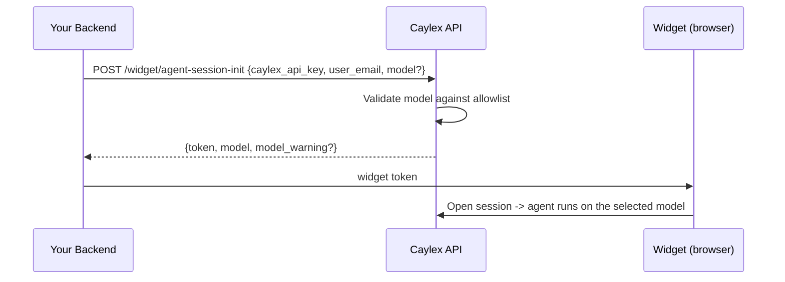

By default, the Caylex agent runs on its configured model. **Model selection** lets your backend override that on a per-session basis by passing an optional `model` when it starts an agent session, so you can match the model to the use case (for example, a faster, cheaper model for lightweight chat, or a larger model for complex work).

## Overview

The model is chosen server-side, at the same place you already start a session: the `POST /widget/agent-session-init` call. Caylex validates the requested model against a curated allowlist, embeds the resolved model in the short-lived widget token, and the agent uses it for every turn of that session.

<Note>
The model is selected by **your backend** when it mints the session token. The widget package (browser) does not choose the model. This keeps model choice under your control and out of the browser.
</Note>

## How It Works



The selected model is recorded on the chat session at initialization, so every subsequent turn in that session uses it. To change the model, start a new session with a different `model`.

## Request

Add an optional `model` to the session-init body:

```json
{
  "caylex_api_key": "ck_your_navigator_api_key",
  "user_email": "jane@example.com",
  "model": "anthropic/claude-opus-4.8"
}
```

| Field | Required | Description |
| --- | --- | --- |
| `model` | No | OpenRouter model id (`provider/model`) from the allowed list below. Omit to use the Caylex agent's configured model. Unsupported values are ignored (the agent keeps its configured model) and return a `model_warning`. |

## Response

```json
{
  "token": "eyJhbGciOiJIUzI1NiIsInR5cCI6IkpXVCJ9...",
  "expires_at": "2026-06-16T15:30:00+00:00",
  "model": "anthropic/claude-opus-4.8",
  "model_warning": null
}
```

| Field | Description |
| --- | --- |
| `model` | The model selected for the session, or `null` when no override applies — either no `model` was requested, or the requested model was unsupported and ignored. In both cases the agent's configured model is used. |
| `model_warning` | `null` on success. Set to a message (listing the allowed models + docs link) when the requested model was unsupported and ignored. |

## Allowed Models

Model selection is restricted to a curated set of capable models across providers and sizes. This prevents accidentally selecting an under-powered model.

| OpenRouter id | Notes |
| --- | --- |
| `anthropic/claude-opus-4.8` | Largest Anthropic model |
| `anthropic/claude-sonnet-4.6` | Balanced — **default** |
| `anthropic/claude-haiku-4.5` | Fast, cost-efficient |
| `openai/gpt-5.5` | OpenAI frontier model |
| `openai/gpt-5.4-mini` | Smaller, cost-efficient |
| `google/gemini-3-pro-preview` | Largest Gemini model |
| `google/gemini-3.5-flash` | Fast, cost-efficient |

If `model` is omitted, the session uses the **Caylex agent's configured model**, falling back to the platform default **`anthropic/claude-sonnet-4.6`** when none is set. Passing `model` only overrides that for the session when you explicitly request a supported one.

## Fallback Behavior

Model selection never fails the session for an unsupported model. If you pass a model that is not on the allowed list:

- The requested model is **ignored** — it does not override the agent's configured model.
- The session is created using the agent's configured model (the same as if no `model` were passed).
- The response `model` is `null` and `model_warning` explains why and lists the allowed models.

This makes it safe to pass a model id without pre-validating it: a typo never silently downgrades the agent's configured model, and the warning surfaces the problem to your backend.

## Example

Add the optional `model` to your existing backend token call.

<Tabs>
  <Tab title="Python">
    ```python token.py
    import httpx

    CAYLEX_API_URL = "https://api.caylex.ai/api/v1/"
    PLATFORM_TOKEN = "your_platform_access_token"
    CAYLEX_API_KEY = "ck_your_navigator_api_key"

    async def mint_widget_token(user_email: str, model: str | None = None) -> str:
        payload = {
            "caylex_api_key": CAYLEX_API_KEY,
            "user_email": user_email,
        }
        if model:
            # Optional; omit to use the agent's configured model.
            payload["model"] = model

        async with httpx.AsyncClient() as client:
            response = await client.post(
                f"{CAYLEX_API_URL}widget/agent-session-init",
                headers={"Authorization": f"Bearer {PLATFORM_TOKEN}"},
                json=payload,
            )
            response.raise_for_status()
            data = response.json()
            if data.get("model_warning"):
                print(data["model_warning"])
            return data["token"]
    ```
  </Tab>

  <Tab title="TypeScript">
    ```typescript token.ts
    const CAYLEX_API_URL = "https://api.caylex.ai/api/v1/";
    const PLATFORM_TOKEN = process.env.CAYLEX_PLATFORM_TOKEN!;
    const CAYLEX_API_KEY = process.env.CAYLEX_NAVIGATOR_API_KEY!;

    export async function mintWidgetToken(
      userEmail: string,
      model?: string,
    ): Promise<string> {
      const response = await fetch(`${CAYLEX_API_URL}widget/agent-session-init`, {
        method: "POST",
        headers: {
          "Authorization": `Bearer ${PLATFORM_TOKEN}`,
          "Content-Type": "application/json",
        },
        body: JSON.stringify({
          caylex_api_key: CAYLEX_API_KEY,
          user_email: userEmail,
          model, // optional; omit to use the agent's configured model
        }),
      });

      if (!response.ok) {
        throw new Error("Failed to mint Caylex widget token");
      }

      const data = await response.json();
      if (data.model_warning) {
        console.warn(data.model_warning);
      }
      return data.token;
    }
    ```
  </Tab>
</Tabs>

The frontend integration is unchanged — pass the returned `token` to the widget as described in [Embedded Widgets](/widget/overview).
