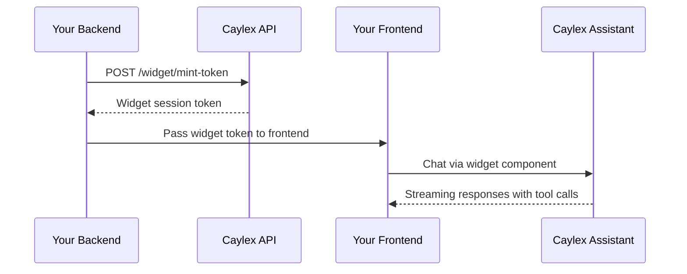

Caylex widgets let you embed AI agents directly inside your SaaS application. You can add an AI chat interface to run full agentic workflows, and optionally add a permissions panel that lets admin users manage which tools are enabled for the agent.

## Overview

Caylex provides two embeddable frontend components:

- **`<CaylexChatWidget />`** — a chat interface that connects to the Caylex Assistants API. It supports streaming responses, tool calls, saved sessions, connected-service visibility, and optional agent-driven page navigation.
- **`<CaylexToolPermissionsWidget />`** — a permissions panel that lets end users control which tools are always allowed, require approval, or are disabled.

Both widgets use **short-lived JWT tokens** minted by your backend. Your platform token and navigator API key stay server-side and never reach the browser.

## How Authentication Works

The widget uses a token-minting pattern:



<Steps>
  <Step title="Mint a widget token on your backend">
    Your backend calls the Caylex API with a platform access token, navigator API key, and user email.
  </Step>
  <Step title="Send the token to your frontend">
    Caylex returns a short-lived JWT that encodes the navigator context and user identity without exposing raw credentials.
  </Step>
  <Step title="Render the widget">
    Your frontend passes the token to the widget component. The widget handles session creation, streaming responses, token refresh, tool call display, and errors.
  </Step>
</Steps>

<Warning>
The mint endpoint must be called from your backend. Never expose your platform access token or navigator API key to the browser.
</Warning>

## Prerequisites

- A Caylex account
- A **Platform Token** from **Administration → Access Tokens**
- A **Navigator API Key** from your project's navigator drawer → **API Keys**
- A **User Email** for the end user who will chat with the assistant
- Node.js 18+ for your backend token endpoint
- React 18+ for the frontend component

## Install Packages

Install the widget packages:

```bash
npm install @caylex/chat-widget @caylex/permissions-widget
```

Install peer dependencies for the chat widget:

```bash
npm install antd @ant-design/icons @emotion/react @emotion/styled lodash.merge react-markdown remark-gfm
```

The permissions widget uses the same peer dependencies except `react-markdown` and `remark-gfm`.

## Step 1: Mint A Widget Token

Your backend mints a token by calling the Caylex API.

<Tabs>
  <Tab title="Python">
    ```python token.py
    import httpx

    CAYLEX_API_URL = "https://api.caylex.ai/api/v1/"
    PLATFORM_TOKEN = "your_platform_access_token"
    CAYLEX_API_KEY = "ck_your_navigator_api_key"

    async def mint_widget_token(user_email: str) -> str:
        async with httpx.AsyncClient() as client:
            response = await client.post(
                f"{CAYLEX_API_URL}widget/mint-token",
                headers={"Authorization": f"Bearer {PLATFORM_TOKEN}"},
                json={
                    "caylex_api_key": CAYLEX_API_KEY,
                    "user_email": user_email,
                },
            )
            response.raise_for_status()
            return response.json()["token"]
    ```
  </Tab>

  <Tab title="TypeScript">
    ```typescript token.ts
    const CAYLEX_API_URL = "https://api.caylex.ai/api/v1/";
    const PLATFORM_TOKEN = process.env.CAYLEX_PLATFORM_TOKEN!;
    const CAYLEX_API_KEY = process.env.CAYLEX_NAVIGATOR_API_KEY!;

    export async function mintWidgetToken(userEmail: string): Promise<string> {
      const response = await fetch(`${CAYLEX_API_URL}widget/mint-token`, {
        method: "POST",
        headers: {
          "Authorization": `Bearer ${PLATFORM_TOKEN}`,
          "Content-Type": "application/json",
        },
        body: JSON.stringify({
          caylex_api_key: CAYLEX_API_KEY,
          user_email: userEmail,
        }),
      });

      if (!response.ok) {
        throw new Error("Failed to mint Caylex widget token");
      }

      const data = await response.json();
      return data.token;
    }
    ```
  </Tab>
</Tabs>

The response includes:

- `token` — the widget JWT to pass to the frontend
- `expires_at` — ISO timestamp of when the token expires

## Step 2: Embed The Chat Widget

Render the widget after your frontend receives a widget token.

### Full-Page Widget

Use this pattern when the assistant is a dedicated page in your app.

```tsx AIAgentPage.tsx
import { useCallback, useEffect, useState } from 'react';
import { CaylexChatWidget } from '@caylex/chat-widget';

async function fetchToken(): Promise<string> {
  const res = await fetch('/api/caylex/token');
  if (!res.ok) throw new Error('Failed to fetch widget token');
  const { token } = await res.json();
  return token;
}

export function AIAgentPage() {
  const [token, setToken] = useState<string | null>(null);

  const refreshToken = useCallback(async () => {
    const nextToken = await fetchToken();
    setToken(nextToken);
    return nextToken;
  }, []);

  useEffect(() => {
    fetchToken().then(setToken).catch(console.error);
  }, []);

  if (!token) return <p>Loading...</p>;

  return (
    <CaylexChatWidget
      apiBaseUrl="https://api.caylex.ai/api/v1/assistants/"
      widgetToken={token}
      refreshToken={refreshToken}
      userName="Jane"
      sampleQueries={[
        'Show me recent orders',
        "Summarize this week's activity",
      ]}
      primaryColor="#3F58CF"
      backgroundColor="#FFFFFF"
      height="100%"
      width="100%"
      borderRadius={12}
      showToolCallDetails
      showServersButton
    />
  );
}
```

### Floating Popup Widget

Use this pattern when you want a chat bubble in the bottom-right corner that persists across pages. Render it in your root layout so it does not unmount during navigation.

```tsx Layout.tsx
import { useState } from 'react';
import { CaylexChatWidget } from '@caylex/chat-widget';

export function Layout({ children }) {
  const [popupOpen, setPopupOpen] = useState(false);
  const [token, setToken] = useState(null);
  // Fetch token on mount and define refreshToken...

  return (
    <div>
      <main>{children}</main>

      {token && !popupOpen && (
        <button
          onClick={() => setPopupOpen(true)}
          style={{
            position: 'fixed',
            bottom: 24,
            right: 24,
            width: 56,
            height: 56,
            borderRadius: '50%',
            background: '#3F58CF',
            color: 'white',
            border: 'none',
            cursor: 'pointer',
            zIndex: 1000,
          }}
        >
          AI Agent
        </button>
      )}

      {token && popupOpen && (
        <div
          style={{
            position: 'fixed',
            bottom: 24,
            right: 24,
            width: 420,
            height: 600,
            borderRadius: 16,
            background: '#fff',
            zIndex: 1000,
            overflow: 'hidden',
            boxShadow: '0 12px 40px rgba(0, 0, 0, 0.15)',
            display: 'flex',
            flexDirection: 'column',
          }}
        >
          <div
            style={{
              padding: '12px 16px',
              borderBottom: '1px solid #eee',
              display: 'flex',
              justifyContent: 'space-between',
            }}
          >
            <span>AI Assistant</span>
            <button onClick={() => setPopupOpen(false)}>Close</button>
          </div>

          <div style={{ flex: 1, minHeight: 0 }}>
            <CaylexChatWidget
              apiBaseUrl="https://api.caylex.ai/api/v1/assistants/"
              widgetToken={token}
              refreshToken={refreshToken}
              primaryColor="#3F58CF"
              backgroundColor="#FFFFFF"
              height="100%"
              width="100%"
              borderRadius={0}
              showToolCallDetails
              showServersButton
            />
          </div>
        </div>
      )}
    </div>
  );
}
```

Because the widget is in the root layout, it stays mounted across page navigations. Chat state, sessions, and server connections are preserved.

## Step 3: Enable Agent-Driven Page Navigation

If you want the assistant to navigate users to different pages in your app, pass a `navigablePages` site map and an `onNavigate` callback.

### Define Your Site Map

```tsx pages.ts
const NAVIGABLE_PAGES = [
  {
    name: 'Dashboard',
    description: 'Main dashboard with summary metrics',
    urlTemplate: '/',
  },
  {
    name: 'Customer Detail',
    description: 'View a specific customer in the CRM',
    urlTemplate: '/crm/{customer_id}',
    params: {
      customer_id: {
        description: 'UUID of the customer',
        required: true,
      },
    },
  },
  {
    name: 'Inventory Filtered',
    description: 'Filter inventory by category and stock status',
    urlTemplate: '/inventory?category={category}&status={status}',
    params: {
      category: {
        description: 'Product category, such as Electronics or Furniture',
        required: false,
      },
      status: {
        description: 'Stock status: In Stock, Low Stock, or Out of Stock',
        required: false,
      },
    },
  },
  {
    name: 'Settings',
    description: 'App settings and configuration',
    urlTemplate: '/settings',
  },
];
```

Each page has:

- `name` — the page name the assistant sees and references
- `description` — optional guidance that helps the assistant know when to navigate there
- `urlTemplate` — a path with `{param}` placeholders. Supports path params and query params.
- `params` — optional metadata for each placeholder

### Pass Navigation To The Widget

```tsx
import { useNavigate } from 'react-router-dom';

export function AIAgentPage({ token }) {
  const navigate = useNavigate();

  return (
    <CaylexChatWidget
      apiBaseUrl="https://api.caylex.ai/api/v1/assistants/"
      widgetToken={token}
      navigablePages={NAVIGABLE_PAGES}
      onNavigate={(url) => navigate(url)}
    />
  );
}
```

The assistant gains two local tools:

- `get_page_info` — looks up URL templates and parameter requirements
- `navigate_page_ui` — triggers your `onNavigate` callback with the resolved URL

When the assistant calls `navigate_page_ui`, the widget constructs the full URL, calls your callback, and the assistant confirms the navigation in chat.

## Step 4: Embed The Permissions Widget

The permissions widget lets users control which tools the assistant can access through the navigator instance. Each tool can be set to:

- **Always Allow** — run without user confirmation
- **User Approval** — require confirmation before each use
- **Disabled** — block the tool

This widget mirrors the **Tool Permissions** tab in the navigator drawer on the Caylex platform. Changes made in either place are reflected in both.

```tsx
import { CaylexToolPermissionsWidget } from '@caylex/permissions-widget';

<CaylexToolPermissionsWidget
  apiBaseUrl="https://api.caylex.ai/api/v1/"
  widgetToken={token}
  refreshToken={refreshToken}
  primaryColor="#3F58CF"
  backgroundColor="#FFFFFF"
  borderRadius={8}
  height="100%"
  width="100%"
  persistPermissions
/>
```

<Warning>
Set `persistPermissions` to `true` for production. When `false` or omitted, changes are local-only and are not saved.
</Warning>

The permissions widget uses the same token pattern as the chat widget, but the token does not require `user_email` because permissions are scoped to the navigator instance, not an individual user.

## Token Refresh

Widget tokens are short-lived. To keep sessions alive without interruption, provide a `refreshToken` callback. The widget automatically calls this function when it receives a `401` response, obtains a fresh token, and retries the request.

```tsx
<CaylexChatWidget
  // ...
  refreshToken={async () => {
    const res = await fetch('/api/caylex/token');
    const data = await res.json();
    return data.token;
  }}
/>
```

Your `/api/caylex/token` endpoint should call the Caylex mint endpoint from your backend and return the new token.

## Customization

### Chat Widget Props

| Prop | Default | Description |
| --- | --- | --- |
| `apiBaseUrl` | — | Caylex Assistants API base URL, usually `https://api.caylex.ai/api/v1/assistants/` |
| `widgetToken` | — | Short-lived widget JWT minted by your backend |
| `userName` | — | Display name shown in the welcome greeting |
| `sampleQueries` | `[]` | Starter queries displayed on the welcome screen |
| `primaryColor` | `#3F58CF` | Accent color for buttons, links, and highlights |
| `backgroundColor` | `#FFFFFF` | Chat window background |
| `theme` | `light` | Active color scheme (`light` or `dark`) |
| `darkPrimaryColor` | — | Primary color override for dark mode |
| `darkBackgroundColor` | — | Background override for dark mode |
| `height` | `600px` | Widget container height |
| `width` | `100%` | Widget container width |
| `borderRadius` | `12` | Border radius of the widget card, in pixels |
| `showToolCallDetails` | `false` | Allow expanding tool call cards to show JSON details |
| `showServersButton` | `true` | Show a Connected Services button in the header |
| `navigablePages` | — | Site map that enables agent-driven page navigation |
| `onNavigate` | — | Callback invoked when the assistant triggers page navigation |
| `sessionName` | `Chat` | Default session name stored on the backend |
| `embedMessages` | `true` | Whether to embed messages for RAG memory |
| `agentInstanceId` | — | Explicit navigator instance ID override. Normally inferred from the API key. |
| `tenantUserId` | — | Your application's user ID, stored on the session for tenant-level user scoping |
| `refreshToken` | — | Async function returning a fresh widget token |
| `onError` | — | Invoked when an unrecoverable error occurs |
| `onSessionCreated` | — | Invoked with the session ID when a new chat session is created |

<Note>
The current widget prop is still named `agentInstanceId` for compatibility. It refers to the Caylex navigator instance.
</Note>

### Permissions Widget Props

| Prop | Default | Description |
| --- | --- | --- |
| `apiBaseUrl` | — | Caylex Analytics API base URL, usually `https://api.caylex.ai/api/v1/` |
| `widgetToken` | — | Short-lived widget JWT minted by your backend |
| `primaryColor` | `#3F58CF` | Accent color |
| `backgroundColor` | `#FFFFFF` | Widget background |
| `theme` | `light` | Active color scheme |
| `darkPrimaryColor` | — | Primary color override for dark mode |
| `darkBackgroundColor` | — | Background override for dark mode |
| `height` | `600px` | Widget container height |
| `width` | `100%` | Widget container width |
| `borderRadius` | `8` | Border radius, in pixels |
| `persistPermissions` | `false` | Save changes to Caylex when users edit permissions |
| `defaultExpandServers` | `false` | Start with server panels expanded |
| `refreshToken` | — | Async function returning a fresh widget token |
| `onError` | — | Invoked when an unrecoverable error occurs |

## Widget Design Space

The Caylex platform includes a **Widget Design Space** where you can:

- Enter your credentials and mint tokens interactively
- Customize colors, dimensions, and feature toggles with live preview
- Test the chat widget with your actual servers and tools
- Switch between chat and permissions widget modes
- Download backend and frontend code snippets for React, script tags, Python, and TypeScript

Use the Widget Design Space to experiment with the widget before integrating it into your application.

## API Base URLs

The chat widget and permissions widget use different Caylex services:

| Widget | Base URL |
| --- | --- |
| Chat widget | `https://api.caylex.ai/api/v1/assistants/` |
| Permissions widget | `https://api.caylex.ai/api/v1/` |

## Updating Widgets

To pull the latest widget versions:

```bash
npm update @caylex/chat-widget @caylex/permissions-widget
```

## Security Model

- **Platform token + navigator API key** stay on your backend
- **Widget JWT** is short-lived and contains only encoded navigator context and user email
- **No raw secrets in the browser** — the widgets communicate using the JWT
- **Playground keys are rejected** — the mint endpoint blocks playground API keys to prevent misuse

## Troubleshooting

| Issue | Cause | Fix |
| --- | --- | --- |
| "Failed to fetch widget token" | Backend not running or credentials invalid | Check your environment variables and ensure your backend endpoint is accessible |
| CORS errors on permissions widget | Analytics API doesn't allow your origin | Use a backend proxy or register your domain with Caylex |
| Connected Services shows 0 | No MCP servers authenticated for the user | Ensure `user_email` matches a user who has connected servers in the Caylex project |
| Agent can't navigate pages | `navigablePages` not passed or `onNavigate` missing | Ensure both props are set on `CaylexChatWidget` |
