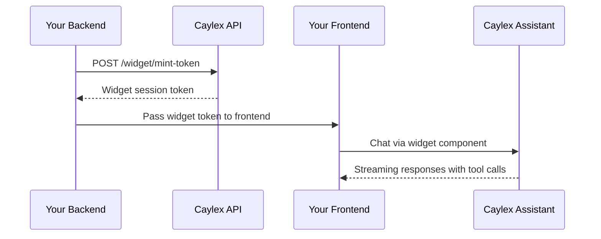

Caylex widgets let you embed AI agents directly inside your SaaS application. You can add an AI chat interface to run full agentic workflows, and optionally add a permissions panel that lets admin users manage which tools are enabled for the agent.

## Overview

Caylex provides two embeddable frontend components:

- **`<CaylexChatWidget />`** — a chat interface that connects to the Caylex Assistants API. It supports streaming responses, tool calls, saved sessions, connected-service visibility, and optional agent-driven page navigation.
- **`<CaylexToolPermissionsWidget />`** — a permissions panel that lets end users control which tools are always allowed, require approval, or are disabled.

Both widgets use **short-lived JWT tokens** minted by your backend. Your platform token and navigator API key stay server-side and never reach the browser.

## How Authentication Works

The widget uses a token-minting pattern:



<Steps>
  <Step title="Mint a widget token on your backend">
    Your backend calls the Caylex API with a platform access token, navigator API key, and user email.
  </Step>
  <Step title="Send the token to your frontend">
    Caylex returns a short-lived JWT that encodes the navigator context and user identity without exposing raw credentials.
  </Step>
  <Step title="Render the widget">
    Your frontend passes the token to the widget component. The widget handles session creation, streaming responses, token refresh, tool call display, and errors.
  </Step>
</Steps>

<Warning>
The mint endpoint must be called from your backend. Never expose your platform access token or navigator API key to the browser.
</Warning>

## Prerequisites

- A Caylex account
- A **Platform Token** from **Administration → Access Tokens**
- A **Navigator API Key** from your project's navigator drawer → **API Keys**
- A **User Email** for the end user who will chat with the assistant
- Node.js 18+ for your backend token endpoint
- React 18+ if you use the React component package

If your frontend does not use React, use the script-tag bundles instead. They include the widget's frontend dependencies and expose browser globals you can call from plain JavaScript.

## Install Packages

If your app uses React, install the widget packages:

```bash
npm install @caylex/chat-widget @caylex/permissions-widget
```

Install peer dependencies for the chat widget:

```bash
npm install antd @ant-design/cssinjs @ant-design/icons @emotion/cache @emotion/react @emotion/styled lodash.merge react-markdown remark-gfm
```

The permissions widget uses the same peer dependencies except `react-markdown` and `remark-gfm`.

The Caylex widget packages install the `@caylex/shared` package automatically.

For script-tag usage, you do not need to install NPM packages in your frontend. Load the hosted bundle from Caylex's asset CDN:

```html
<script src="https://assets.caylex.ai/widgets/chat-widget.js"></script>
<script src="https://assets.caylex.ai/widgets/permissions-widget.js"></script>
```

The unversioned URLs always serve the latest widgets. For production stability, you can pin a specific version:

```html
<script src="https://assets.caylex.ai/widgets/chat-widget@0.1.8.js"></script>
<script src="https://assets.caylex.ai/widgets/permissions-widget@0.1.4.js"></script>
```

<Warning>
The widgets isolate their Ant Design and Emotion styles from the host app by using a widget-specific Ant Design class prefix, injecting Ant Design css-in-js and Emotion styles into the widget root, and mounting widget popovers/drawers inside the widget container.

This prevents normal Ant Design theme/style collisions between your app and the widgets. It is not a full Shadow DOM or iframe boundary: extremely broad global CSS in the host app, such as `* { ... !important }`, `button { all: unset }`, or global `textarea` rules, can still affect embedded widget DOM. Avoid broad global selectors if you want the widget to render exactly as designed.
</Warning>

## Step 1: Mint A Widget Token

Your backend mints a token by calling the Caylex API.

<Tabs>
  <Tab title="Python">
    ```python token.py
    import httpx

    CAYLEX_API_URL = "https://api.caylex.ai/api/v1/"
    PLATFORM_TOKEN = "your_platform_access_token"
    CAYLEX_API_KEY = "ck_your_navigator_api_key"

    async def mint_widget_token(user_email: str) -> str:
        async with httpx.AsyncClient() as client:
            response = await client.post(
                f"{CAYLEX_API_URL}widget/mint-token",
                headers={"Authorization": f"Bearer {PLATFORM_TOKEN}"},
                json={
                    "caylex_api_key": CAYLEX_API_KEY,
                    "user_email": user_email,
                },
            )
            response.raise_for_status()
            return response.json()["token"]
    ```
  </Tab>

  <Tab title="TypeScript">
    ```typescript token.ts
    const CAYLEX_API_URL = "https://api.caylex.ai/api/v1/";
    const PLATFORM_TOKEN = process.env.CAYLEX_PLATFORM_TOKEN!;
    const CAYLEX_API_KEY = process.env.CAYLEX_NAVIGATOR_API_KEY!;

    export async function mintWidgetToken(userEmail: string): Promise<string> {
      const response = await fetch(`${CAYLEX_API_URL}widget/mint-token`, {
        method: "POST",
        headers: {
          "Authorization": `Bearer ${PLATFORM_TOKEN}`,
          "Content-Type": "application/json",
        },
        body: JSON.stringify({
          caylex_api_key: CAYLEX_API_KEY,
          user_email: userEmail,
        }),
      });

      if (!response.ok) {
        throw new Error("Failed to mint Caylex widget token");
      }

      const data = await response.json();
      return data.token;
    }
    ```
  </Tab>
</Tabs>

The response includes:

- `token` — the widget JWT to pass to the frontend
- `expires_at` — ISO timestamp of when the token expires

## Step 2: Embed The Chat Widget

Render the widget after your frontend receives a widget token.

<Tabs>
  <Tab title="React">

### Full-Page Widget

Use this pattern when the assistant is a dedicated page in your app.

```tsx AIAgentPage.tsx
import { useCallback, useEffect, useState } from 'react';
import { CaylexChatWidget } from '@caylex/chat-widget';

async function fetchToken(): Promise<string> {
  const res = await fetch('/api/caylex/token');
  if (!res.ok) throw new Error('Failed to fetch widget token');
  const { token } = await res.json();
  return token;
}

export function AIAgentPage() {
  const [token, setToken] = useState<string | null>(null);

  const refreshToken = useCallback(async () => {
    const nextToken = await fetchToken();
    setToken(nextToken);
    return nextToken;
  }, []);

  useEffect(() => {
    fetchToken().then(setToken).catch(console.error);
  }, []);

  if (!token) return <p>Loading...</p>;

  return (
    <CaylexChatWidget
      apiBaseUrl="https://api.caylex.ai/api/v1/assistants/"
      widgetToken={token}
      refreshToken={refreshToken}
      userName="Jane"
      sampleQueries={[
        'Show me recent orders',
        "Summarize this week's activity",
      ]}
      primaryColor="#3F58CF"
      backgroundColor="#FFFFFF"
      height="100%"
      width="100%"
      borderRadius={12}
      showToolCallDetails
      showServersButton
    />
  );
}
```

### Floating Popup Widget

Use this pattern when you want a chat bubble in the bottom-right corner that persists across pages. Render it in your root layout so it does not unmount during navigation.

```tsx Layout.tsx
import { useState } from 'react';
import { CaylexChatWidget } from '@caylex/chat-widget';

export function Layout({ children }) {
  const [popupOpen, setPopupOpen] = useState(false);
  const [token, setToken] = useState(null);
  // Fetch token on mount and define refreshToken...

  return (
    <div>
      <main>{children}</main>

      {token && !popupOpen && (
        <button
          onClick={() => setPopupOpen(true)}
          style={{
            position: 'fixed',
            bottom: 24,
            right: 24,
            width: 56,
            height: 56,
            borderRadius: '50%',
            background: '#3F58CF',
            color: 'white',
            border: 'none',
            cursor: 'pointer',
            zIndex: 1000,
          }}
        >
          AI Agent
        </button>
      )}

      {token && popupOpen && (
        <div
          style={{
            position: 'fixed',
            bottom: 24,
            right: 24,
            width: 420,
            height: 600,
            borderRadius: 16,
            background: '#fff',
            zIndex: 1000,
            overflow: 'hidden',
            boxShadow: '0 12px 40px rgba(0, 0, 0, 0.15)',
            display: 'flex',
            flexDirection: 'column',
          }}
        >
          <div
            style={{
              padding: '12px 16px',
              borderBottom: '1px solid #eee',
              display: 'flex',
              justifyContent: 'space-between',
            }}
          >
            <span>AI Assistant</span>
            <button onClick={() => setPopupOpen(false)}>Close</button>
          </div>

          <div style={{ flex: 1, minHeight: 0 }}>
            <CaylexChatWidget
              apiBaseUrl="https://api.caylex.ai/api/v1/assistants/"
              widgetToken={token}
              refreshToken={refreshToken}
              primaryColor="#3F58CF"
              backgroundColor="#FFFFFF"
              height="100%"
              width="100%"
              borderRadius={0}
              showToolCallDetails
              showServersButton
            />
          </div>
        </div>
      )}
    </div>
  );
}
```

Because the widget is in the root layout, it stays mounted across page navigations. Chat state, sessions, and server connections are preserved.

  </Tab>

  <Tab title="Script Tag">

Use this pattern when your frontend is not a React app. The script bundle exposes `window.CaylexChat.render()`.

```html chat-widget.html
<!-- Caylex Chat Widget -->
<div id="caylex-chat" style="width: 100%; height: 600px;"></div>

<script src="https://assets.caylex.ai/widgets/chat-widget.js"></script>
<script>
  async function fetchWidgetToken() {
    const res = await fetch('/api/caylex/token');
    if (!res.ok) throw new Error('Failed to fetch widget token');
    const { token } = await res.json();
    return token;
  }

  async function mountCaylexChat() {
    const token = await fetchWidgetToken();

    CaylexChat.render(document.getElementById('caylex-chat'), {
      apiBaseUrl: 'https://api.caylex.ai/api/v1/assistants/',
      widgetToken: token,
      refreshToken: fetchWidgetToken,
      userName: 'Jane',
      sampleQueries: [
        'Show me recent orders',
        "Summarize this week's activity",
      ],
      primaryColor: '#3F58CF',
      backgroundColor: '#FFFFFF',
      height: '100%',
      width: '100%',
      borderRadius: 12,
      showToolCallDetails: true,
      showServersButton: true,
    });
  }

  mountCaylexChat().catch(console.error);
</script>
```

To pin a specific widget version, use a versioned script URL:

```html
<script src="https://assets.caylex.ai/widgets/chat-widget@0.1.8.js"></script>
```

<Note>
The script-tag bundle includes React and the widget UI dependencies internally. Your app does not need to install or provide those packages.
</Note>

  </Tab>
</Tabs>

## Step 3: Enable Agent-Driven Page Navigation

If you want the assistant to navigate users to different pages in your app, pass a `navigablePages` site map and an `onNavigate` callback.

For simple apps, this site map can be static frontend data. For production SaaS apps, we recommend exposing it from your backend so you can return only the pages available to the current tenant and user.

### Expose The Effective Site Map From Your Backend

Your backend should return a `NavigablePage[]` array. This endpoint can apply your existing tenant, feature flag, and user permission logic before sending pages to the browser.

```typescript navigation.ts
type NavigablePage = {
  name: string;
  description?: string;
  urlTemplate: string;
  params?: Record<string, { description: string; required?: boolean }>;
};

const ALL_NAVIGABLE_PAGES: NavigablePage[] = [
  {
    name: 'Dashboard',
    description: 'Main dashboard with summary metrics',
    urlTemplate: '/',
  },
  {
    name: 'Customer Detail',
    description: 'View a specific customer in the CRM',
    urlTemplate: '/crm/{customer_id}',
    params: {
      customer_id: {
        description: 'UUID of the customer',
        required: true,
      },
    },
  },
  {
    name: 'Inventory Filtered',
    description: 'Filter inventory by category and stock status',
    urlTemplate: '/inventory?category={category}&status={status}',
    params: {
      category: {
        description: 'Product category, such as Electronics or Furniture',
        required: false,
      },
      status: {
        description: 'Stock status: In Stock, Low Stock, or Out of Stock',
        required: false,
      },
    },
  },
  {
    name: 'Settings',
    description: 'App settings and configuration',
    urlTemplate: '/settings',
  },
];

export async function getNavigablePagesForUser(user: {
  tenantId: string;
  userId: string;
  role: string;
}): Promise<NavigablePage[]> {
  // Apply your custom logic here. For example:
  // - omit pages for tenant features that are not enabled
  // - omit admin-only pages for non-admin users
  // - omit pages that do not apply to the user's store, team, or region
  const tenantFeatures = await loadTenantFeatureFlags(user.tenantId);
  const permissions = await loadUserPermissions(user.userId);

  return ALL_NAVIGABLE_PAGES.filter((page) => {
    if (page.name === 'Inventory Filtered' && !tenantFeatures.inventory) {
      return false;
    }

    if (page.name === 'Settings' && !permissions.canManageSettings) {
      return false;
    }

    return true;
  });
}
```

Then expose an authenticated endpoint from your SaaS app:

```typescript routes.ts
app.get('/api/caylex/navigable-pages', requireAuth, async (req, res) => {
  const pages = await getNavigablePagesForUser({
    tenantId: req.user.tenantId,
    userId: req.user.id,
    role: req.user.role,
  });

  res.json(pages);
});
```

Each page has:

- `name` — the page name the assistant sees and references
- `description` — optional guidance that helps the assistant know when to navigate there
- `urlTemplate` — a path with `{param}` placeholders. Supports path params and query params.
- `params` — optional metadata for each placeholder

<Note>
The site map controls what the assistant can discover for navigation, but it is not a security boundary. Your app should still enforce normal authorization when a user visits a page.
</Note>

### Fetch And Pass Navigation To The Widget

<Tabs>
  <Tab title="React">

```tsx
import { useEffect, useState } from 'react';
import { useNavigate } from 'react-router-dom';
import { CaylexChatWidget, type NavigablePage } from '@caylex/chat-widget';

async function fetchNavigablePages(): Promise<NavigablePage[]> {
  const res = await fetch('/api/caylex/navigable-pages');
  if (!res.ok) throw new Error('Failed to fetch navigable pages');
  return res.json();
}

export function AIAgentPage({ token }) {
  const navigate = useNavigate();
  const [navigablePages, setNavigablePages] = useState<NavigablePage[]>([]);

  useEffect(() => {
    fetchNavigablePages().then(setNavigablePages).catch(console.error);
  }, []);

  return (
    <CaylexChatWidget
      apiBaseUrl="https://api.caylex.ai/api/v1/assistants/"
      widgetToken={token}
      navigablePages={navigablePages}
      onNavigate={(url) => navigate(url)}
    />
  );
}
```

  </Tab>

  <Tab title="Script Tag">

```html
<script>
  async function fetchNavigablePages() {
    const res = await fetch('/api/caylex/navigable-pages');
    if (!res.ok) throw new Error('Failed to fetch navigable pages');
    return res.json();
  }

  async function mountCaylexChat() {
    const [token, navigablePages] = await Promise.all([
      fetchWidgetToken(),
      fetchNavigablePages(),
    ]);

    CaylexChat.render(document.getElementById('caylex-chat'), {
      apiBaseUrl: 'https://api.caylex.ai/api/v1/assistants/',
      widgetToken: token,
      refreshToken: fetchWidgetToken,
      navigablePages,
      onNavigate: (url) => {
        window.location.href = url;
      },
    });
  }
</script>
```

  </Tab>
</Tabs>

The assistant gains two local tools:

- `get_page_info` — looks up URL templates and parameter requirements
- `navigate_page_ui` — triggers your `onNavigate` callback with the resolved URL

When the assistant calls `navigate_page_ui`, Caylex resolves the URL template, the widget calls your callback with the resolved URL, and the assistant confirms the navigation in chat.

## Step 4: Embed The Permissions Widget

The permissions widget lets users control which tools the assistant can access through the navigator instance. Each tool can be set to:

- **Always Allow** — run without user confirmation
- **User Approval** — require confirmation before each use
- **Disabled** — block the tool

This widget mirrors the **Tool Permissions** tab in the navigator drawer on the Caylex platform. Changes made in either place are reflected in both.

<Tabs>
  <Tab title="React">

```tsx
import { CaylexToolPermissionsWidget } from '@caylex/permissions-widget';

<CaylexToolPermissionsWidget
  apiBaseUrl="https://api.caylex.ai/api/v1/"
  widgetToken={token}
  refreshToken={refreshToken}
  primaryColor="#3F58CF"
  backgroundColor="#FFFFFF"
  borderRadius={8}
  height="100%"
  width="100%"
  persistPermissions
/>
```

  </Tab>

  <Tab title="Script Tag">

```html permissions-widget.html
<!-- Caylex Permissions Widget -->
<div id="caylex-permissions" style="width: 100%; height: 600px;"></div>

<script src="https://assets.caylex.ai/widgets/permissions-widget.js"></script>
<script>
  async function fetchWidgetToken() {
    const res = await fetch('/api/caylex/token');
    if (!res.ok) throw new Error('Failed to fetch widget token');
    const { token } = await res.json();
    return token;
  }

  async function mountCaylexPermissions() {
    const token = await fetchWidgetToken();

    CaylexPermissions.render(document.getElementById('caylex-permissions'), {
      apiBaseUrl: 'https://api.caylex.ai/api/v1/',
      widgetToken: token,
      refreshToken: fetchWidgetToken,
      primaryColor: '#3F58CF',
      backgroundColor: '#FFFFFF',
      borderRadius: 8,
      height: '100%',
      width: '100%',
      persistPermissions: true,
    });
  }

  mountCaylexPermissions().catch(console.error);
</script>
```

To pin a specific permissions widget version, use a versioned script URL:

```html
<script src="https://assets.caylex.ai/widgets/permissions-widget@0.1.4.js"></script>
```

  </Tab>
</Tabs>

<Warning>
Set `persistPermissions` to `true` for production. When `false` or omitted, changes are local-only and are not saved.
</Warning>

The permissions widget uses the same token pattern as the chat widget, but the token does not require `user_email` because permissions are scoped to the navigator instance, not an individual user.

## Token Refresh

Widget tokens are short-lived. To keep sessions alive without interruption, provide a `refreshToken` callback. The widget automatically calls this function when it receives a `401` response, obtains a fresh token, and retries the request.

<Tabs>
  <Tab title="React">

```tsx
<CaylexChatWidget
  // ...
  refreshToken={async () => {
    const res = await fetch('/api/caylex/token');
    const data = await res.json();
    return data.token;
  }}
/>
```

  </Tab>

  <Tab title="Script Tag">

```html
<script>
  async function fetchWidgetToken() {
    const res = await fetch('/api/caylex/token');
    const data = await res.json();
    return data.token;
  }

  async function mountCaylexChat() {
    const initialToken = await fetchWidgetToken();

    CaylexChat.render(document.getElementById('caylex-chat'), {
      // ...
      widgetToken: initialToken,
      refreshToken: fetchWidgetToken,
    });
  }
</script>
```

  </Tab>
</Tabs>

Your `/api/caylex/token` endpoint should call the Caylex mint endpoint from your backend and return the new token.

## Customization

### Chat Widget Props

| Prop | Default | Description |
| --- | --- | --- |
| `apiBaseUrl` | — | Caylex Assistants API base URL, usually `https://api.caylex.ai/api/v1/assistants/` |
| `widgetToken` | — | Short-lived widget JWT minted by your backend |
| `userName` | — | Display name shown in the welcome greeting |
| `sampleQueries` | `[]` | Starter queries displayed on the welcome screen |
| `primaryColor` | `#3F58CF` | Accent color for buttons, links, and highlights |
| `backgroundColor` | `#FFFFFF` | Chat window background |
| `theme` | `light` | Active color scheme (`light` or `dark`) |
| `darkPrimaryColor` | — | Primary color override for dark mode |
| `darkBackgroundColor` | — | Background override for dark mode |
| `height` | `600px` | Widget container height |
| `width` | `100%` | Widget container width |
| `borderRadius` | `12` | Border radius of the widget card, in pixels |
| `showToolCallDetails` | `false` | Allow expanding tool call cards to show JSON details |
| `showServersButton` | `true` | Show a Connected Services button in the header |
| `navigablePages` | — | Effective site map, usually fetched from your backend, that enables agent-driven page navigation |
| `onNavigate` | — | Callback invoked when the assistant triggers page navigation |
| `sessionName` | `Chat` | Default session name stored on the backend |
| `embedMessages` | `true` | Whether to embed messages for RAG memory |
| `agentInstanceId` | — | Explicit navigator instance ID override. Normally inferred from the API key. |
| `tenantUserId` | — | Your application's user ID, stored on the session for tenant-level user scoping |
| `refreshToken` | — | Async function returning a fresh widget token |
| `onError` | — | Invoked when an unrecoverable error occurs |
| `onSessionCreated` | — | Invoked with the session ID when a new chat session is created |

<Note>
The current widget prop is still named `agentInstanceId` for compatibility. It refers to the Caylex navigator instance.
</Note>

### Permissions Widget Props

| Prop | Default | Description |
| --- | --- | --- |
| `apiBaseUrl` | — | Caylex Analytics API base URL, usually `https://api.caylex.ai/api/v1/` |
| `widgetToken` | — | Short-lived widget JWT minted by your backend |
| `primaryColor` | `#3F58CF` | Accent color |
| `backgroundColor` | `#FFFFFF` | Widget background |
| `theme` | `light` | Active color scheme |
| `darkPrimaryColor` | — | Primary color override for dark mode |
| `darkBackgroundColor` | — | Background override for dark mode |
| `height` | `600px` | Widget container height |
| `width` | `100%` | Widget container width |
| `borderRadius` | `8` | Border radius, in pixels |
| `persistPermissions` | `false` | Save changes to Caylex when users edit permissions |
| `defaultExpandServers` | `false` | Start with server panels expanded |
| `refreshToken` | — | Async function returning a fresh widget token |
| `onError` | — | Invoked when an unrecoverable error occurs |

## Widget Design Space

The Caylex platform includes a **Widget Design Space** where you can:

- Enter your credentials and mint tokens interactively
- Customize colors, dimensions, and feature toggles with live preview
- Test the chat widget with your actual servers and tools
- Switch between chat and permissions widget modes
- Download backend and frontend code snippets for React, script tags, Python, and TypeScript

Use the Widget Design Space to experiment with the widget before integrating it into your application.

## API Base URLs

The chat widget and permissions widget use different Caylex services:

| Widget | Base URL |
| --- | --- |
| Chat widget | `https://api.caylex.ai/api/v1/assistants/` |
| Permissions widget | `https://api.caylex.ai/api/v1/` |

## Updating Widgets

For React package usage, pull the latest widget versions with NPM:

```bash
npm update @caylex/chat-widget @caylex/permissions-widget
```

For script-tag usage, the unversioned CDN URLs automatically serve the latest deployed widgets:

```html
<script src="https://assets.caylex.ai/widgets/chat-widget.js"></script>
<script src="https://assets.caylex.ai/widgets/permissions-widget.js"></script>
```

If you want release stability, pin an explicit version and update the URL when you are ready to upgrade:

```html
<script src="https://assets.caylex.ai/widgets/chat-widget@0.1.8.js"></script>
<script src="https://assets.caylex.ai/widgets/permissions-widget@0.1.4.js"></script>
```

## Security Model

- **Platform token + navigator API key** stay on your backend
- **Widget JWT** is short-lived and contains only encoded navigator context and user email
- **No raw secrets in the browser** — the widgets communicate using the JWT
- **Playground keys are rejected** — the mint endpoint blocks playground API keys to prevent misuse

## Troubleshooting

| Issue | Cause | Fix |
| --- | --- | --- |
| "Failed to fetch widget token" | Backend not running or credentials invalid | Check your environment variables and ensure your backend endpoint is accessible |
| `CaylexChat is not defined` or `CaylexPermissions is not defined` | Script-tag bundle did not load | Check that the script URL is reachable, allowed by your Content Security Policy, and loaded before calling `render()` |
| CORS errors on permissions widget | Analytics API doesn't allow your origin | Use a backend proxy or register your domain with Caylex |
| Connected Services shows 0 | No MCP servers authenticated for the user | Ensure `user_email` matches a user who has connected servers in the Caylex project |
| Agent can't navigate pages | `navigablePages` is empty, the site map fetch failed, or `onNavigate` is missing | Ensure your backend site map endpoint returns pages and both navigation options are passed to the chat widget |
