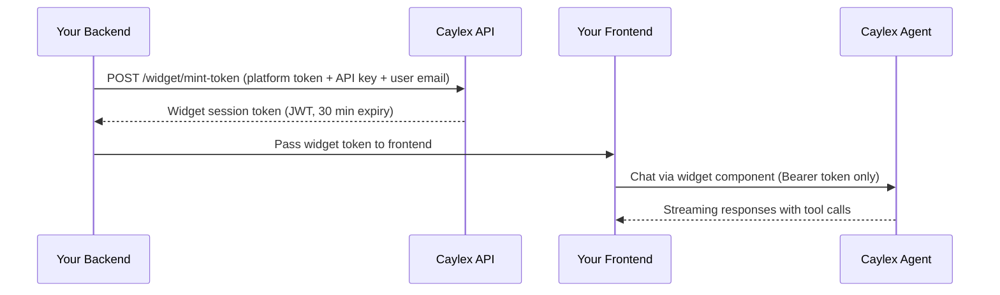

The Agent Widget is an embeddable frontend component that gives your users a chat interface with a tool-calling AI agent — connected to all your Caylex servers — out of the box. Drop it into your application, and your users get a fully functioning agent experience without building any AI infrastructure.

## How it works

The widget uses a **session token** pattern to keep your credentials secure:



1. **Your backend** calls the Caylex API to mint a short-lived widget session token. This requires three pieces of information:
   - **Platform access token** — minted on the Administration page of your Caylex dashboard
   - **Navigator API key** — the `ck_...` key from your Navigator Instance
   - **User email** — the email of the end user who will be chatting

2. **Caylex returns a widget JWT** (valid for 30 minutes by default). This token encodes the navigator context and user identity without exposing your raw API key.

3. **Your frontend** receives the widget token and passes it to the `CaylexChatWidget` component. The widget handles the entire chat experience — session initialization, streaming responses, tool call display, and error handling.

Your raw API key and platform token never leave your backend. The browser only ever sees the short-lived widget JWT.

## What you need

| Credential | Where to find it | Purpose |
| --- | --- | --- |
| **Platform access token** | Administration page in the Caylex dashboard | Authorizes your backend to mint widget tokens |
| **Navigator API key** | Navigator Instance page → API Keys | Identifies which navigator and project to use |
| **User email** | Your application's auth context | Determines which user credentials to use for tool execution |

## Mint a widget token

Your backend mints a token by calling the Caylex API:

<Tabs>
  <Tab title="Python">
    ```python
    import requests

    def get_widget_token(user_email: str) -> str:
        response = requests.post(
            "https://api.caylex.ai/api/v1/widget/mint-token",
            headers={
                "Authorization": f"Bearer {PLATFORM_ACCESS_TOKEN}",
            },
            json={
                "caylex_api_key": NAVIGATOR_API_KEY,
                "user_email": user_email,
            },
        )
        data = response.json()
        return data["token"]
    ```
  </Tab>
  <Tab title="TypeScript">
    ```typescript
    async function getWidgetToken(userEmail: string): Promise<string> {
      const response = await fetch(
        "https://api.caylex.ai/api/v1/widget/mint-token",
        {
          method: "POST",
          headers: {
            "Authorization": `Bearer ${PLATFORM_ACCESS_TOKEN}`,
            "Content-Type": "application/json",
          },
          body: JSON.stringify({
            caylex_api_key: NAVIGATOR_API_KEY,
            user_email: userEmail,
          }),
        }
      );
      const data = await response.json();
      return data.token;
    }
    ```
  </Tab>
</Tabs>

The response includes:
- `token` — the widget JWT to pass to the frontend
- `expires_at` — ISO timestamp of when the token expires

<Warning>
The mint endpoint must be called from your **backend**. Never expose your platform access token or Navigator API key to the browser.
</Warning>

## Embed the chat widget

Once your frontend has a widget token, render the chat widget:

<Tabs>
  <Tab title="React">
    ```jsx
    import { CaylexChatWidget } from "@caylex/chat-widget";

    function App({ widgetToken }) {
      return (
        <CaylexChatWidget
          apiBaseUrl="https://api.caylex.ai/api/v1/assistants/"
          widgetToken={widgetToken}
          userName="Jane"
          sampleQueries={[
            "What can you help me with?",
            "Show me my recent activity",
          ]}
          refreshToken={async () => {
            const res = await fetch("/api/caylex/token");
            const data = await res.json();
            return data.token;
          }}
        />
      );
    }
    ```
  </Tab>
  <Tab title="Script tag">
    ```html
    <div id="caylex-widget"></div>
    <script src="https://cdn.caylex.ai/widget.js"></script>
    <script>
      CaylexWidget.render("#caylex-widget", {
        apiBaseUrl: "https://api.caylex.ai/api/v1/assistants/",
        widgetToken: "YOUR_WIDGET_TOKEN",
        userName: "Jane",
      });
    </script>
    ```
  </Tab>
</Tabs>

## Token refresh

Widget tokens expire after 30 minutes. To keep sessions alive without interruption, provide a `refreshToken` callback. The widget automatically calls this function when it receives a 401 response, obtains a fresh token, and retries the request seamlessly.

```jsx
<CaylexChatWidget
  // ...
  refreshToken={async () => {
    const res = await fetch("/api/caylex/token");
    const data = await res.json();
    return data.token;
  }}
/>
```

Your `/api/caylex/token` endpoint should call the Caylex mint endpoint on the backend and return the new token.

## Customization

The widget is fully customizable to match your application's look and feel:

### Colors and theming

| Prop | Default | Description |
| --- | --- | --- |
| `primaryColor` | `#3F58CF` | Accent color for buttons, links, and highlights |
| `backgroundColor` | `#FFFFFF` | Chat window background |
| `assistantBubbleColor` | `#F1F4FD` | Background color for assistant message bubbles |
| `theme` | `light` | Active color scheme (`light` or `dark`) |
| `darkPrimaryColor` | — | Primary color override for dark mode |
| `darkBackgroundColor` | — | Background override for dark mode |
| `darkAssistantBubbleColor` | — | Bubble color override for dark mode |

<Note>
Dark mode is only active when at least one `dark*` color prop is provided and `theme` is set to `dark`. If no dark colors are set, the widget always uses the base colors.
</Note>

### Layout

| Prop | Default | Description |
| --- | --- | --- |
| `height` | `600px` | Widget container height |
| `width` | `100%` | Widget container width |
| `borderRadius` | `12` | Border radius of the widget card (px) |

### Feature toggles

| Prop | Default | Description |
| --- | --- | --- |
| `showToolCallDetails` | `false` | Allow expanding tool call cards to show JSON request/response details |
| `showServersButton` | `true` | Show a "Connected Services" button in the header listing available servers |
| `sampleQueries` | `[]` | Starter queries displayed on the welcome screen |
| `userName` | — | Display name shown in the welcome greeting |

### Behavior

| Prop | Default | Description |
| --- | --- | --- |
| `sessionName` | `Chat` | Default session name stored on the backend |
| `embedMessages` | `true` | Whether to embed messages for RAG memory |
| `agentInstanceId` | — | Explicit navigator instance ID override (normally inferred from the API key) |
| `tenantUserId` | — | Your application's user ID, stored on the session for tenant-level user scoping |

### Callbacks

| Prop | Description |
| --- | --- |
| `refreshToken` | Async function returning a fresh widget token. Called on 401 for auto-refresh. |
| `onError` | Invoked when an unrecoverable error occurs |
| `onSessionCreated` | Invoked with the session ID when a new chat session is created |

## Widget Design Space

The Caylex platform includes a **Widget Design Space** where you can:

- Enter your credentials and mint tokens interactively
- Customize colors, dimensions, and feature toggles with live preview
- Test the chat widget with your actual servers and tools
- Download ready-to-use backend and frontend code snippets (React, script tag, Python, TypeScript)

Navigate to the **Widget Design Space** from the Caylex dashboard to experiment with the widget before integrating it into your application.

## Tool Permissions Widget

In addition to the chat widget, Caylex provides a **Tool Permissions Widget** — an embeddable UI that lets your users control which tools are enabled or disabled for their navigator instance.

This is useful if you want to give end users the ability to customize their agent's capabilities directly within your application.

The permissions widget uses the same token pattern as the chat widget (mint a token via your backend, pass it to the frontend component), but the token does not require a `user_email` since permissions are scoped to the navigator instance, not individual users.

## Security model

- **Platform token + API key** stay on your backend — never exposed to the browser
- **Widget JWT** is short-lived (30 minutes) and contains only the encoded navigator context and user email
- **No raw secrets in the browser** — the widget only communicates using the JWT
- **Playground keys are rejected** — the mint endpoint explicitly blocks playground API keys to prevent misuse
