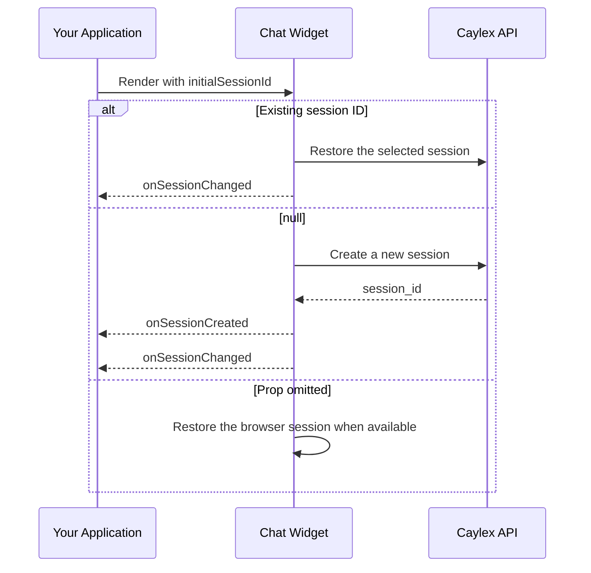

The Caylex chat widget can manage sessions automatically, or your application can choose which session opens and react when the active session changes. Host-managed sessions are useful when a conversation belongs to a resource in your application, such as a document, support case, project, or canvas.

## How It Works



Your application owns any mapping between its resources and Caylex session IDs. Caylex only needs the Caylex session ID.

## Choose The Initial Session

Pass `initialSessionId` when your application should control which conversation opens:

| Value | Behavior |
| --- | --- |
| A session ID | Restore that existing Caylex chat session |
| `null` | Create a new session and ignore any session saved by the browser |
| Omitted | Preserve the widget's default browser-session restoration behavior |

`initialSessionId` is an initialization-time prop. To switch sessions after the widget has loaded, use the widget's built-in session menu.

<Note>
If the supplied session ID cannot be restored, the widget calls `onError`. It does not silently create a replacement session.
</Note>

## Observe Session Changes

The widget provides two session callbacks:

| Callback | When it runs | Payload |
| --- | --- | --- |
| `onSessionCreated` | The widget creates a new chat session | The new `sessionId` |
| `onSessionChanged` | The active session or session view changes | `{ sessionId, sessionType }` |

`sessionType` is either:

- `chat` — a normal interactive chat session
- `background_task` — a background-task transcript or approval view

A newly created session triggers `onSessionCreated` first, followed by `onSessionChanged`. Restoring an existing session triggers only `onSessionChanged`.

The change callback also runs when the user switches between a normal chat and a background-task view, even when both views reference the same session ID.

## Example

The following example lets the host application restore a mapped session or explicitly request a new one:

```tsx
import { CaylexChatWidget } from '@caylex/chat-widget';

export function ResourceAssistant({
  widgetToken,
  savedSessionId,
  saveSessionId,
}: {
  widgetToken: string;
  savedSessionId: string | null;
  saveSessionId: (sessionId: string) => void;
}) {
  return (
    <CaylexChatWidget
      apiBaseUrl="https://api.caylex.ai/api/v1/assistants/"
      widgetToken={widgetToken}
      initialSessionId={savedSessionId}
      onSessionCreated={(sessionId) => {
        saveSessionId(sessionId);
      }}
      onSessionChanged={({ sessionId, sessionType }) => {
        console.log('Active Caylex session', sessionId, sessionType);
      }}
    />
  );
}
```

When no mapping exists, pass `null` rather than omitting the prop. This guarantees that the widget creates a new session instead of restoring an unrelated browser session.

<Warning>
Resolve your application's saved-session lookup before rendering the widget.
Do not temporarily pass `null` while that lookup is still loading, because
`null` intentionally creates a new session.
</Warning>

## Programmatic Chat Turns

Your backend can send a normal user turn to an existing widget session. The message behaves like a turn typed in the composer: Caylex appends it to the transcript, runs the agent, stores the response, and returns the completed turn.

Enable external synchronization on widgets that need to display these turns:

```tsx
<CaylexChatWidget
  // ...
  enableExternalSessionSync
  externalSessionSyncIntervalMs={5000}
/>
```

External synchronization is disabled by default. When enabled, the widget checks for persisted updates only while the tab is visible and the interactive session is idle.

Capture new IDs with `onSessionCreated`, store them in your backend, and call the platform-authenticated session-message API from your backend:

```http
POST https://api.caylex.ai/api/v1/assistants/sessions/{session_id}/messages
Authorization: Bearer <platform_access_token>
Content-Type: application/json
```

<Warning>
Call the programmatic session API from your backend. Platform access tokens and navigator API keys must never be exposed to the browser.
</Warning>

See [Programmatic Chat Sessions](/cookbooks/programmatic-chat-sessions) for the request contract, identity checks, session lookup options, and complete examples.

## Background Task Sessions

The chat widget can also display [background agent tasks](/background-tasks/agent-tasks). When a user opens a background task or approval, `onSessionChanged` reports `sessionType: "background_task"`. When the user returns to an interactive chat, it reports `sessionType: "chat"`.

This allows the host application to keep its own UI synchronized with the conversation currently displayed inside the widget.

## Session Props

| Prop | Default | Description |
| --- | --- | --- |
| `initialSessionId` | — | Session to restore when the widget initializes. Pass `null` to explicitly create a new session; omit the prop to preserve browser restoration. |
| `onSessionCreated` | — | Called with the new session ID when the widget creates a session. |
| `onSessionChanged` | — | Called with `{ sessionId, sessionType }` whenever the active session or session view changes. |
| `enableExternalSessionSync` | `false` | Poll for turns sent through the programmatic session-message API. |
| `externalSessionSyncIntervalMs` | `5000` | External session polling interval in milliseconds; minimum `1000`. |
